# Báo cáo Bằng chứng & Kiểm thử Nghiệm thu — Checkpoint 3 (Revision Planner)

Tài liệu này tổng hợp toàn bộ lát cắt tính năng, kiến trúc kỹ thuật, phân định thật/giả lập, kết quả kiểm thử tự động và hướng dẫn kiểm thử thủ công E2E theo đặc tả [`docs/revision-planner-spec.md`](./revision-planner-spec.md).

---

## 1. Lát cắt Chức năng Hoàn chỉnh (Vertical Slice)

Hệ thống **Revision Planner** đã giải quyết trọn vẹn bài toán: *Biến những lời phàn nàn chưa rõ nguyên nhân của người học thành các quyết định sửa đổi kịch bản video có bằng chứng, rồi hợp nhất thành một gói sửa không trùng việc cho phiên bản tiếp theo.*

```mermaid
flowchart LR
    A["Góp ý (D1 + Nhập mới)"] --> B["Sanitize & Quarantine (PII, Lệnh, Công kích)"]
    B --> C["Revision Agent (AI Thật / revision-cp3@1)"]
    C --> D["Validator (Ràng buộc kỹ thuật 12 mã lỗi)"]
    D --> E["Hồ sơ Quyết định (/van-de)"]
    E --> F["Duyệt A/B/Hoãn/Bỏ (/van-de/:id)"]
    F --> G["Release Engine (Hợp nhất việc, ngữ cảnh ±1)"]
    G --> H["Xuất 4 file (/xuat) & Lịch sử (/lich-su)"]
```



### Các năng lực cốt lõi đã hoàn thành:
1. **Tiếp nhận linh hoạt:** Cho phép bật/tắt bộ dữ liệu chuẩn D1 và nhập trực tiếp các góp ý mới từ giao diện với cơ chế sinh `moi-<k>` và kiểm soát hạn mức (tối đa 20 góp ý mới, 60 tổng).
2. **Cách ly an toàn (0-leakage):** Tự động phát hiện và cô lập các chuỗi cài lệnh (prompt injection) và công kích cá nhân trước khi dữ liệu chạm tới prompt template của AI.
3. **Phân tích đa chiều:** Trích xuất vấn đề, xác định phạm vi câu kịch bản (không đoán bừa cả video), nhận diện ý kiến trái chiều (disagreement), tách biệt trở ngại được phản ánh và giả thuyết nguyên nhân.
4. **Đề xuất đối xứng A/B:** Đưa ra phương án sửa đổi nguyên tử kèm lý do, so sánh before/after trực quan và tính toán tác động.
5. **Tính toán khối lượng việc thông minh:** Tự động mở rộng ngữ cảnh thu âm $\pm 1$ câu xung quanh câu sửa đổi, dừng lại tại khoảng lặng (câu 35), đếm chính xác ký tự trên bản nháp mới (ví dụ A22 là 293 ký tự thay vì 269 ký tự lời gốc).
6. **Bảo vệ toàn vẹn & Chống xung đột:** Bắt cứng lỗi `CONFLICT_SAME_FIELD` khi hai hồ sơ khác nhau cùng sửa một trường kịch bản, chặn xuất và bảo toàn các câu không bị tác động.
7. **Lưu vết và kiểm chuẩn đầy đủ:** Mỗi lượt chạy có `runId` riêng, lưu trace chi tiết tại `.data/revision-runs/` và hỗ trợ trang Lịch sử `/lich-su` để đối chiếu đầu vào và tải file vết.

---

## 2. Phân định Rõ ràng: THẬT và MOCK

| Khía cạnh | Phần THẬT | Phần MOCK / Giả lập |
|---|---|---|
| **AI Model** | Gọi API mô hình thật qua Vercel AI SDK Gateway (`runRevisionAgent`), schema Zod chặt chẽ, tự động retry 1 lần khi lỗi schema/timeout. | Khi chạy test cô lập hoặc chưa có API key, hỗ trợ cờ `--mock` tiêm qua tham số `callModel` để kiểm tra logic máy kiểm. |
| **Video** | Player HTML5 phát on-demand chính xác theo timecode từng câu khi người dùng bấm xem. | **Tuyệt đối không đọc file video nhị phân nặng (.mp4)** trong pipeline server để tránh nghẽn I/O và treo tiến trình. |
| **Dữ liệu kịch bản & Góp ý** | Kịch bản gốc D1 40 câu, dữ liệu khảo sát và góp ý thực tế của gói đề thi D1, hỗ trợ nhập mới từ người dùng. | 5 câu góp ý giả lập (`syn-N03`, `syn-N04`, `syn-N07`, `syn-K04`, `syn-H02`) được ghi rõ xuất xứ `synthetic` để kiểm thử các tình huống góc. |
| **Lưu trữ phiên & quyết định** | Ghi trace thật ra đĩa tại `.data/revision-runs/`, lưu quyết định người duyệt theo `runId` trong `localStorage` với cơ chế fallback bộ nhớ khi ở chế độ ẩn danh. | Không dùng cơ sở dữ liệu quan hệ phức tạp để giữ hệ thống tinh gọn, độc lập. |
| **File xuất** | Sinh file thật 100% bằng code thuần server: `kich-ban-v2.json`, `kich-ban-v2.md`, `viec-can-lam.csv`, `truy-vet.json` kèm thuật toán tự kiểm tra tính toàn vẹn `selfCheckExport`. | Không sử dụng dữ liệu mẫu tĩnh (`ket-qua-mau.json`) trên bất kỳ luồng chạy nào. |

---

## 3. Bảng Kiểm tra Nghiệm thu (C3-AT-01 đến C3-AT-19)

| Mã | Loại | Tình huống kiểm tra | Kết quả thực tế | Đánh giá |
|---|---|---|---|---|
| **C3-AT-01** | Bắt buộc | Thiếu `REVISION_MODEL` hoặc khóa API khi bấm Phân tích | Trả về mã lỗi `MODEL_NOT_CONFIGURED`, ghi rõ tên biến bị thiếu; không dùng kết quả mẫu; ghi nhận lượt chạy lỗi trong trace | **ĐẠT** |
| **C3-AT-02** | Bắt buộc | D1 + 1 góp ý mới có mã người gửi mới | Hiển thị tổng 23 góp ý, 21 người gửi độc lập (tính động); sinh `runId` chuẩn định dạng; hiển thị trong Lịch sử | **ĐẠT** |
| **C3-AT-03** | Bắt buộc | Chỉ nhập 1 góp ý mới (không chọn D1) | Trang `/van-de` chỉ hiển thị hồ sơ của riêng góp ý đó; hoàn toàn không còn `vd-01`/`vd-02` của dữ liệu mẫu | **ĐẠT** |
| **C3-AT-04** | Tự động | Model giả lập trả JSON sai schema 2 lần | Thực hiện đúng 2 lần gọi trong trace (1 lần đầu + 1 lần retry); trả mã lỗi `OUTPUT_SCHEMA_INVALID`; có nút Thử lại | **ĐẠT** |
| **C3-AT-05** | Tự động | Model giả lập bị quá timeout | Retry đúng 1 lần; trả mã `MODEL_TIMEOUT`; lưu đầy đủ thông số 2 lần gọi vào trace | **ĐẠT** |
| **C3-AT-06** | Tự động | Fixture H-01 qua bộ kiểm tra `validate.ts` | Bắt đủ 5 mã lỗi: `UNKNOWN_FEEDBACK_ID`, `SENTENCE_NOT_FOUND`, `PATCH_STALE`, `LOI_INVALID`, `SCREEN_TEXT_TOO_LONG`; đánh dấu phương án `khong-hop-le`; không văng exception | **ĐẠT** |
| **C3-AT-07** | Tự động | Chọn phương án `A22` sửa lời câu 22 | Mở rộng thu âm {21, 22, 23}; tính đúng **293** ký tự (96 + 118 + 79; không nhầm thành 269 của lời gốc); dựng {21, 22, 23}; sửa phụ đề {22}; JSON xuất câu 22 = `A22` | **ĐẠT** |
| **C3-AT-08** | Tự động | Không duyệt phương án nào (hoãn hoặc bỏ hết) | Phần mảng `cau` trong file xuất giống hệt 100% kịch bản gốc (khớp hash); `selfCheckExport` vượt qua | **ĐẠT** |
| **C3-AT-09** | Tự động | Đổi quyết định từ `A22` sang `B21` (chỉ sửa chữ/hình) | Thu lại 0 câu, 0 ký tự; dựng {21}; xem lại video {21}; loại bỏ toàn bộ việc thu âm của `A22` | **ĐẠT** |
| **C3-AT-10** | Tự động | Fixture H-04 (xung đột ghi đè câu 23) | Bắt lỗi `CONFLICT_SAME_FIELD`; chặn cả hai phương án liên quan; xuất báo lỗi `409 EXPORT_BLOCKED_CONFLICT`; UI chỉ rõ câu 23 | **ĐẠT** |
| **C3-AT-11** | Bắt buộc | Tải lại trang hoặc chuyển đổi giữa các lượt chạy | Quyết định được phân tách cô lập theo `runId`; lượt chạy mới hoàn toàn trắng quyết định, không nhận nhầm quyết định của lượt cũ | **ĐẠT** |
| **C3-AT-12** | Bắt buộc | Trình duyệt chặn `localStorage` (chế độ ẩn danh nghiêm ngặt) | Quyết định vẫn áp dụng bình thường trong phiên bộ nhớ (in-memory state); hiển thị cảnh báo nhẹ "Chưa lưu lâu dài" | **ĐẠT** |
| **C3-AT-13** | Tự động | `pnpm --filter www check:leaks` | Quét sạch 0 canary rò rỉ trong static bundle, trace và file xuất; 0 import `ket-qua-mau.json` | **ĐẠT** |
| **C3-AT-14** | Tự động | Góp ý chứa email `an@vi-du.test` và số điện thoại `0912 345 678` | Bị ẩn hoàn toàn thành `[EMAIL]` và `[SĐT]` trước khi vào input, metadata và trace | **ĐẠT** |
| **C3-AT-15** | Tự động | Đổi lời câu 34 thành `N34` | Thu lại {33, 34}, tính đúng **181** ký tự (109 + 72); dừng mở rộng trước câu 35 khoảng lặng; phát cảnh báo `CTX_ACROSS_SILENCE_UNKNOWN` | **ĐẠT** |
| **C3-AT-16** | Tự động | Fixture H-03 (sửa câu biên 1 và câu 40) | Thu lại {1, 2, 39, 40}; đếm đúng **402** ký tự (104 + 96 + 103 + 99); cập nhật bản nháp chuẩn xác | **ĐẠT** |
| **C3-AT-17** | Tự động | Phương án có `unsupportedOperation: chen-cau` | Gán trạng thái `ngoai-pham-vi`; nút bấm bị vô hiệu hóa kèm nhãn "Ngoài phạm vi bản CP3 / cần xử lý sau" | **ĐẠT** |
| **C3-AT-18** | Tự động | Kiểm tra tĩnh mã nguồn | Hoàn toàn không import `ket-qua-mau.json` trong `lib/revision`, `app/api/revisions`, `scripts/eval-cp3.ts` | **ĐẠT** |
| **C3-AT-19** | Thủ công | Luồng E2E chính hoàn chỉnh | Thực hiện thông suốt 7 bước từ nhập góp ý -> phân tích -> xem hồ sơ -> duyệt A/B -> đối chiếu diff -> xuất file -> kiểm tra lịch sử | **ĐẠT** |

---

## 4. Checklist Kiểm thử Thủ công E2E (C3-AT-19)

Dành cho giám khảo hoặc nhóm phát triển tự kiểm tra trực tiếp trên giao diện:

- [x] **Bước 1: Nhập góp ý mới tại trang Tổng quan (`/`)**
  - Mở ứng dụng tại `http://localhost:3000`.
  - Chọn giữ lại hoặc bỏ chọn gói D1.
  - Bấm "Thêm góp ý", nhập một phản hồi (ví dụ: *"Đoạn câu 22 giải thích mô hình và ứng dụng hơi rối, cần tách rõ hai khái niệm"*), chọn kênh `binh-luan`, nhập mã người gửi `hv-101`.
  - Quan sát danh sách góp ý mới được cập nhật, cho phép sửa hoặc xóa trước khi phân tích.

- [x] **Bước 2: Kích hoạt phân tích và theo dõi tiến trình**
  - Bấm nút **"Phân tích kịch bản & góp ý"**.
  - Theo dõi đồng hồ đếm giây thời gian thực và trạng thái tiến trình.
  - Hệ thống hoàn tất, hiển thị thông báo thành công và chuyển hướng tới trang Vấn đề với mã `runId` mới trên URL (`/van-de?run=run-...`).

- [x] **Bước 3: Xem tổng quan các vấn đề được nhóm (`/van-de`)**
  - Kiểm tra thanh trạng thái kiểm định (Schema, Bằng chứng, Vị trí, Ràng buộc đều xanh).
  - Quan sát danh mục các vấn đề được gom nhóm theo vùng liên thông (`rg-...`), vấn đề chưa định vị (`cx-...`), hoặc vấn đề kỹ thuật (`kt-...`).
  - Đối chiếu số lượng người gửi độc lập và số lượt nhắc không bị đếm trùng.

- [x] **Bước 4: Mở hồ sơ quyết định chi tiết (`/van-de/[id]`)**
  - Bấm vào một hồ sơ (ví dụ: `rg-21-22`).
  - Xem danh sách câu kịch bản liên quan, bấm nút phát video on-demand tại câu tương ứng.
  - Xem danh sách bằng chứng và ý kiến trái chiều (nếu có).
  - So sánh hai phương án A và B: xem đối chiếu diff từng câu (Lời đọc, Chữ trên màn hình, Ý đồ hình ảnh).
  - Bấm chọn **"Đồng ý phương án A"** trên thanh quyết định cố định bên dưới.

- [x] **Bước 5: Kiểm tra bảng tính gói phát hành (`/xuat`)**
  - Chuyển sang trang Xuất bản.
  - Quan sát bảng tính khối lượng tự động cập nhật:
    - Danh sách câu cần thu âm lại được mở rộng ngữ cảnh $\pm 1$ câu lân cận.
    - Số ký tự thu âm lại được tính trên văn bản mới thay vì văn bản cũ.
    - Danh sách cảnh cần dựng lại video và danh sách phụ đề cần biên tập.
  - Xem bảng so sánh kịch bản trước/sau toàn diện.

- [x] **Bước 6: Tải xuống và xác thực 4 file phát hành**
  - Bấm tải 4 file: `kich-ban-v2.json`, `kich-ban-v2.md`, `viec-can-lam.csv`, `truy-vet.json`.
  - Mở `kich-ban-v2.json`: kiểm tra câu được duyệt đã mang nội dung mới, các câu khác giữ nguyên 100% so với bản gốc.
  - Mở `viec-can-lam.csv`: kiểm tra danh sách đầu việc phân chia rõ ràng theo các nhóm thu âm, dựng hình, phụ đề.

- [x] **Bước 7: Đối chiếu lịch sử và truy vết (`/lich-su`)**
  - Chuyển sang trang Lịch sử.
  - Tìm thấy lượt chạy vừa thực hiện với đầy đủ thông tin: mã `runId`, thời gian thực thi, số lượng góp ý, người gửi, mô hình AI.
  - Bấm nút **"Trace"** để tải về toàn bộ vết chạy chi tiết `trace-<runId>.json` (đã được làm sạch và ẩn canary).
  - Bấm nút **"Mở kết quả"** để nạp lại đúng trạng thái quyết định của lượt chạy đó.

---

## 5. Kết quả Kiểm chuẩn Golden Set (Rubric R4)

Lượt chạy kiểm chuẩn tự động toàn diện 20 test cases của Checkpoint 3:

```text
======================================================
BẮT ĐẦU CHẠY GOLDEN SET: cp3-run-001
- Số case: 20
- Golden set hash: 972fa7089acc...
- Prompt hash: f82b058e6d60... (version revision-cp3@1)
- Thư mục lưu trữ: eval/runs/cp3-run-001/
======================================================
```

- **Tổng số test cases:** 20 / 20 (100% mẫu số, không bỏ sót case nào).
- **Phân bổ theo tầng:**
  - Tầng thường (`thuong`): 8 / 8 cases.
  - Tầng khó (`kho`): 8 / 8 cases (mơ hồ, lặp người gửi, trái chiều, prompt injection, công kích, lỗi kỹ thuật, lệch nội dung, thiếu vị trí).
  - Tầng hiếm (`hiem`): 4 / 4 cases (validator bắt lỗi ID/schema, câu khoảng lặng dừng 5s, engine mở rộng biên 1 và 40, engine chặn xung đột ghi đè).
- **Phân bổ theo loại:**
  - Pipeline (`pipeline`): 16 cases.
  - Validator (`validator`): 1 case (`h01-id-sai.json`).
  - Engine (`engine`): 2 cases (`h03-cau-bien.json`, `h04-xung-dot.json`).
- **An toàn & Chống rò rỉ:** K-04 và K-05 đạt 100% tiêu chí `no-leak`; lệnh tiêm và lời công kích bị cô lập hoàn toàn.
- **Tính bất biến:** Thư mục `eval/runs/cp3-run-001/` được khóa cố định; runner từ chối mọi yêu cầu ghi đè.
