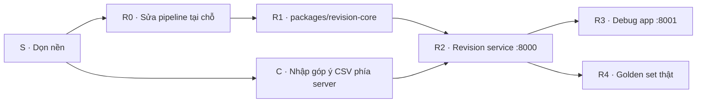

# Hướng dẫn thực hiện tiếp — Revision Planner sau MVP

Ngày lập: 17/09/2026 · Mốc mã: commit `510c2de` trên `main`.
Người đọc: thành viên nhóm và agent code nhận việc tiếp theo.

Tài liệu này là **sổ tay làm việc**: làm gì, theo thứ tự nào, sửa file nào, khi nào coi là xong. Thiết kế chi tiết (đồ thị, API, màn hình) nằm ở tài liệu thiết kế; ở đây chỉ nhắc lại phần cần để làm đúng.

## 0. Đọc tài liệu nào, cái nào thắng

| Tài liệu | Vai trò | Khi mâu thuẫn |
|---|---|---|
| `docs/ke-hoach-thuc-hien-tiep.md` (file này) | Thứ tự việc, cách làm, tiêu chí xong | Thắng về **thứ tự và phạm vi công việc** |
| `docs/revision-service-debug-plan.md` | Thiết kế đích: đồ thị cố định, API service, debug, eval chung pipeline, AR-01…AR-15 | Thắng về **kiến trúc, API, đồ thị** |
| `docs/revision-planner-spec.md` | Yêu cầu sản phẩm, dữ liệu, mã lỗi, các trang đã thống nhất | Thắng về **hành vi sản phẩm** |
| `docs/agent-pipeline-ui-plan.md` | Lịch sử P0–P3, bài học | Chỉ tham khảo; trạng thái đã được đánh giá lại |
| `docs/revision-planner-plan.md` | Plan CP3 gốc | Chỉ tham khảo |

## 1. Hiện trạng ngắn gọn

**Đang chạy được**
- Studio nhiều video: thư viện, trang video với các tab Xem video · Kịch bản chi tiết · Góp ý · Đề xuất chỉnh sửa · Bản sửa · Lịch sử phiên bản.
- Góp ý lưu phía server theo video/phiên bản (`apps/www/src/lib/studio/feedback-store.ts`); thêm tay hoặc **tải lên CSV** (gộp từ `feature/csv-import`, gửi qua API theo lô 20).
- Phân tích chạy nền: `POST /api/revisions/analyze` trả `202`, sự kiện `events.jsonl` + SSE, nhịp báo sống 5 s, hủy run.
- Pipeline tách hai bước AI: hiểu góp ý (một lời gọi) → lập phương án theo từng vấn đề (song song 3). Cache theo node.
- Trang `/dev/runs` (bật bằng `REVISION_DEBUG_UI=1`): đồ thị node sau khi chạy, thanh tra node, chạy lại node, so sánh hai run.

**Chưa đạt — phải sửa** (bằng chứng ở `revision-service-debug-plan.md` §1)
1. `cases.ready` phát **sau** khi mọi phương án xong, không sớm.
2. Không có vòng sửa theo lỗi patch; validator chạy một lần ở cuối.
3. **Hai pipeline**: UI dùng `background-runner.ts`, còn `scripts/eval-cp3.ts` và `?sync=1` dùng `service.ts` một lời gọi.
4. Màn chờ `analysis-progress-panel.tsx` còn node cũ `MODEL_PHAN_TICH` không bao giờ chạy.
5. Sơ đồ pipeline không cố định, không trực tiếp, không có ở màn người dùng.
6. Quyết định duyệt chỉ ở `localStorage`; client tự tính gói bản sửa.
7. Agent, pipeline, debug đều nằm trong Next.js; debug chỉ chặn bằng cờ env.
8. Golden set chưa chạy thật (mọi run trong `eval/runs` là `mock-agent`).

**Tồn đọng từ lần gộp nhánh**
- `eval copy/` (từ commit `testcase`) là bộ golden set **mạnh hơn** `eval/golden-set.v1.json`: góp ý tổng hợp riêng cho từng case, `expected` có cấu trúc, `passCriteria` máy kiểm được, có `ingestion-cases.v1.json` cho loader JSON + CSV. Chưa được hợp nhất.
- Nhánh `origin/feature/csv-import` vẫn còn; phần cần thiết đã chép vào `main` (không phải merge commit).
- Parser CSV chạy ở trình duyệt; server chỉ nhận dữ liệu đã tách cột.

## 2. Chuẩn bị môi trường

```bash
pnpm install
cp apps/www/.env.example apps/www/.env   # nếu chưa có
pnpm --filter www dev                     # http://localhost:3000
pnpm --filter www typecheck
```

Biến môi trường (chỉ ghi tên, **không dán giá trị vào tài liệu, issue, chat**):

| Biến | Dùng cho | Ghi chú |
|---|---|---|
| `OPENAI_API_KEY`, `OPENAI_MODELS` | Gọi model thật | Sau R2 chỉ service giữ |
| `REVISION_MODEL_TIMEOUT_MS`, `REVISION_MAX_OUTPUT_TOKENS` | Giới hạn lời gọi | Mặc định 150000 ms, 16000 token |
| `REVISION_NODE_CACHE` | `0` để tắt cache node | |
| `STUDIO_DATA_DIR` | Nơi lưu run, góp ý, cache | Mặc định `apps/www/.data/studio` |
| `REVISION_DEBUG_UI` | Bật `/dev/runs` | **Xóa khỏi `.env` trước mọi buổi demo ngoài**; bị bỏ ở R3 |

**Dữ liệu ban tổ chức không nằm trong git.** Mỗi người tự đặt gói vào `data/studio-pack/c5-feedbackradar/` (đã ignore bằng `/data`). Ảnh slide trong `apps/www/public/slide-anh/` và `apps/www/src/data/slide-d1.json` là **bản sao** từ gói, cũng không commit — xem việc S2.

Trên Windows + Git Bash, khi gọi đường dẫn bắt đầu bằng `/` (ví dụ `/dev/runs`) dùng `MSYS_NO_PATHCONV=1`. Next dev trả HTTP 200 cho trang 404, nên kiểm tra nội dung chứ không chỉ mã trạng thái.

## 3. Quy tắc làm việc

1. **Mỗi giai đoạn một nhánh**, tên `r0-…`, `r1-…`, mở PR vào `main`. Không push thẳng `main` trừ sửa tài liệu nhỏ.
2. **App luôn chạy được** sau mỗi PR: `pnpm --filter www typecheck` sạch, luồng người dùng chính (mục 6) chạy tay được.
3. **Không fallback âm thầm.** Thiếu service, thiếu key, model lỗi → báo lỗi rõ có mã; không tự quay về kết quả mẫu hay pipeline cũ.
4. **Không dùng giá trị do model sinh làm khóa** gộp hoặc cache (`issue.key`, `summary`). Khóa dựng từ dữ liệu code kiểm soát: `feedbackIds`, `sentenceNs`, `category`.
5. **"Node xong" không phải bằng chứng đúng.** Khi báo cáo tiến độ, kèm số liệu kết quả (số vấn đề, số vùng có phương án, số phương án hợp lệ) và so với run trước.
6. **Không commit**: `.env*`, `data/`, bản sao ảnh/slide của gói, `.data/`, run eval giả lập (`test-*`). Góp ý thật không trích nguyên văn lời công kích/cài lệnh vào tài liệu.
7. **Không hiển thị suy luận nội bộ của model**; chỉ output có cấu trúc, lý do ngắn, lỗi kiểm tra.
8. Commit hook chạy `biome format`; chạy `pnpm lint` trước khi mở PR.
9. Đánh giá trạng thái trong tài liệu phải kèm bằng chứng (tên file/hàm, số đo). Đánh dấu ✅ chỉ khi tiêu chí AR tương ứng đã chạy qua.

## 4. Lộ trình tổng thể



| Giai đoạn | Phụ thuộc | Có thể làm song song với | Ước lượng |
|---|---|---|---|
| S — dọn nền | — | — | 0,5 ngày |
| R0 — sửa pipeline tại chỗ | S | C1 | 2–3 ngày |
| C — CSV phía server | S | R0 | 1 ngày |
| R1 — tách package | R0 | R4a (hợp nhất golden set) | 1–2 ngày |
| R2 — service | R1, C | — | 3 ngày |
| R3 — debug app | R2 | R4b | 2–3 ngày |
| R4 — golden set thật | R4a sau R0; R4b sau R2 | R3 | 1–2 ngày |

## 5. Chi tiết từng giai đoạn

### S — Dọn nền (làm trước tiên)

| Mã | Việc | Cách làm | Xong khi |
|---|---|---|---|
| S1 | Giữ bản MVP đã nộp | `git tag mvp-cp3 1ad4228 && git push origin mvp-cp3` (commit "new MVP" là bản nộp; nếu nhóm xác định khác thì dùng commit đó) | Tag có trên GitHub |
| S2 | Ảnh slide không phụ thuộc bản sao trong git | Script `apps/www/scripts/sync-pack-assets.ts` chép `data/studio-pack/.../video-mau/slide-anh/*` → `apps/www/public/slide-anh/` và `slide-d1.json` → `apps/www/src/data/`; thêm hai đường dẫn đó vào `.gitignore`; gọi script trong `predev`. Thiếu gói → in cảnh báo rõ đường dẫn cần có, UI hiện ô "Chưa có ảnh slide" thay vì ảnh vỡ | Clone mới + đặt gói + `pnpm dev` thấy ảnh; không đặt gói thì thấy cảnh báo, không lỗi build |
| S3 | Dọn thư mục eval | Đổi `eval copy/` → `eval/golden/` (golden set, coverage, batches, pool), `eval/ingestion-cases.v1.json`, mẫu run vào `eval/runs/_templates/`. Giữ `eval/golden-set.v1.json` cũ với tên `eval/golden-set.v0-pack.json` và ghi chú "không còn là chuẩn". Gộp hai README thành một | Không còn thư mục có dấu cách; README nói rõ bộ nào là chuẩn |
| S4 | Nhánh CSV | Hỏi người phụ trách `feature/csv-import` xác nhận phần đã gộp đủ, rồi xóa nhánh remote | Nhánh đã xóa hoặc có lý do giữ |
| S5 | Cờ debug | Xóa `REVISION_DEBUG_UI=1` khỏi `.env` máy demo; ghi vào checklist demo | — |

### R0 — Sửa pipeline tại chỗ (chưa đổi kiến trúc)

Mục tiêu: pipeline hiện tại chạy đúng thiết kế trước khi tách. Toàn bộ trong `apps/www` và `packages/ai`.

**R0.1 — Định nghĩa đồ thị cố định**
- Tạo `apps/www/src/lib/revision/pipeline/graph.ts` xuất `PIPELINE_GRAPH` (danh sách `PipelineNodeDef` đúng bảng §3.1 thiết kế) và `GRAPH_VERSION = "revision@2"`.
- Thêm route `GET /api/revisions/pipeline` trả đồ thị (sau R2 chuyển thành `GET /pipeline` của service).
- `RunMetadata.graphVersion` ghi `GRAPH_VERSION`.

**R0.2 — Runner phát sự kiện theo id đồ thị**
- Trong `background-runner.ts`, đổi `nodeId` kiểu `N4_PHAN_LOAI`, `N8_LAP_PHUONG_AN_3` sang id đồ thị (`hieu-gop-y`, `de-xuat`) + `iterationKey` (khóa vùng, ví dụ `rg-20-23`).
- Bổ sung sự kiện `node.skipped`, `node.retry {attempt, reason}`, `node.cache_hit {sourceRunId}` trong `events.ts`.
- Mọi `node.started` phải có id thuộc `PIPELINE_GRAPH`; thêm kiểm tra khi phát sự kiện (id lạ → ném lỗi trong dev).
- Run cũ vẫn đọc được: debug hiển thị theo `graphVersion` của run; run không có `graphVersion` hiện nhãn "định dạng cũ".

**R0.3 — Lập hồ sơ vùng trước khi đề xuất**
- Tách phần gom vấn đề, đếm người, nhóm trái chiều, chia vùng ra hàm `lapHoSoVung(issues, feedback, script)` chỉ dùng output của `hieu-gop-y` (không cần phương án).
- Phát `partial: cases.ready` ngay sau hàm này, với `options: []` và trạng thái vùng `dang-lap-phuong-an`.
- Vòng lặp `lap-phuong-an` chạy **theo vùng** (không theo vấn đề); vùng xong thì phát `partial: case.options.ready {caseId}`.
- UI tab Đề xuất: hiện danh sách vùng + phần A–C khi nhận `cases.ready`; phần phương án của từng vùng hiện khi vùng đó xong, vùng chưa xong hiện "Đang đề xuất…".

**R0.4 — Kiểm tra patch trong từng vùng, vòng sửa ≤2**
- Tách từ `validate.ts` hàm `validateCaseOptions(caseDraft, options, script)` chỉ kiểm tra phương án của một vùng.
- Trong worker của vùng: `de-xuat` → `kiem-tra-de-xuat`; nếu có lỗi chặn, gọi lại `de-xuat` kèm danh sách lỗi (`_loiKiemTraLanTruoc`), tối đa 2 lần, phát `node.retry`. Hết lần → phương án gắn `khong-hop-le` kèm lỗi, **không** chặn vùng khác.
- `tinh-pham-vi` chạy sau khi kiểm tra đạt.
- Validator tổng ở cuối giữ lại làm lưới an toàn; nếu nó còn phát hiện lỗi patch thì ghi `finding` mức cao (nghĩa là vòng trong bị lọt).
- Cache: khóa của `de-xuat` gồm input vùng + danh sách lỗi của lần thử (lần sửa không dùng cache của lần đầu).

**R0.5 — Một pipeline duy nhất**
- Tạo `runPipelineToCompletion(input, opts)` trong `background-runner.ts`: gọi cùng runner nền và chờ tới `run.finished`, trả kết quả cuối.
- `scripts/eval-cp3.ts` và nhánh `?sync=1` trong `analyze/route.ts` gọi hàm này thay cho `analyzeRevision`.
- Eval hỗ trợ `input.feedbacks` tổng hợp (golden set mới) bằng cách truyền `newFeedback` và `includeD1Feedback: false`.
- Model giả cho eval đi qua cùng runner, bật bằng `REVISION_MODEL_MODE=mock`; run ghi `mode: "gia-lap"`.
- Xóa `analyzeRevision` một lời gọi và prompt cũ nếu không còn nơi nào dùng (kiểm bằng grep). Giữ `prompt.ts` chỉ khi eval cũ cần đọc lại để so sánh.

**R0.6 — Sơ đồ pipeline cố định cho người dùng**
- Component mới `components/studio/pipeline-flow.tsx`: vẽ node `userVisible` từ `GET /api/revisions/pipeline` **ngay khi mở tab**, kể cả khi chưa có run.
- Trạng thái lấy từ SSE `/runs/:id/events` (dùng lại logic kết nối của `analysis-progress-panel.tsx`), tải lại trang thì dựng lại từ `events`.
- Sáu trạng thái có chữ + biểu tượng: chưa chạy · đang chạy (giây) · xong · lỗi · bỏ qua · dùng lại kết quả trước.
- Node `lap-phuong-an` hiện `k/n vùng`, bấm mở danh sách vùng.
- Chạy xong thu thành một dòng tóm tắt; bấm mở lại.
- Xóa `analysis-progress-panel.tsx` khi đã thay xong. Không hiện prompt, token, output thô.
- Layout: một hàng ngang trên màn rộng; dưới 640px xếp dọc, không cuộn ngang trang.

**R0.7 — Cập nhật tài liệu**
- `agent-pipeline-ui-plan.md`: đánh dấu P1/P2/P0c theo kết quả AR thật.
- `revision-planner-spec.md`: thêm sự kiện mới, `cases.ready` sớm, `case.options.ready`.

**Tiêu chí xong R0:** AR-01…AR-05 (thiết kế §8) chạy qua, cộng thêm:

| Mã | Kiểm tra | Kỳ vọng |
|---|---|---|
| R0-A | Chạy thật D1 22 góp ý, ghi mốc thời gian | `cases.ready` trước `node.started` đầu tiên của `de-xuat`; ghi số giây vào PR |
| R0-B | So kết quả với run trước R0 cùng input | Số vùng có phương án và số phương án hợp lệ **không giảm**; nếu giảm phải giải thích |
| R0-C | Chạy lại lần hai, cache bật | Không gọi model; sơ đồ hiện "dùng lại kết quả trước" |
| R0-D | `grep -r analyzeRevision apps/www` | Không còn nơi gọi |

### C — Nhập góp ý CSV phía server

Hiện parser chạy ở trình duyệt; server nhận các trường đã tách. Chuyển xử lý về server để làm sạch, giới hạn và kiểm thử cùng một chỗ.

| Mã | Việc | Chi tiết |
|---|---|---|
| C1 | Chuyển parser | Di chuyển `lib/studio/csv-import.ts` thành hàm thuần dùng được ở server (không phụ thuộc DOM). Thêm route `POST /api/studio/videos/[id]/feedback/import` nhận `text/csv` (giới hạn 1 MB, 500 dòng), trả `{ preview, warnings }` khi `?dryRun=1` và lưu khi xác nhận. Không còn chia lô 20 ở client |
| C2 | An toàn dữ liệu | Cột người gửi đi qua cùng bước ẩn PII như góp ý nhập tay; nội dung đi qua `sanitize.ts` trước khi xem trước; không lưu `rawText`. Mã góp ý trong file chỉ lưu làm `sourceRef`, mã nội bộ do server cấp |
| C3 | Chống nạp trùng | Băm `(sender, text, survey)`; dòng trùng với góp ý đã lưu của cùng phiên bản → cảnh báo "đã có", mặc định bỏ qua |
| C4 | Kiểm thử | Chạy các case CSV trong `eval/ingestion-cases.v1.json` (sau S3) thành test tự động; thêm case: ô nhiều dòng trong ngoặc kép, BOM, dấu `;` (Excel VN), dòng chỉ có điểm, dòng trống, tệp 501 dòng |
| C5 | UI | Panel CSV gọi `dryRun` để xem trước, hiện số dòng hợp lệ/bỏ qua/trùng, rồi xác nhận một lần |

**Xong khi:** C4 chạy qua; nạp cùng file hai lần không nhân đôi góp ý; tệp quá hạn mức báo lỗi `INPUT_INVALID` có số dòng.

### R1 — Tách `packages/revision-core`

- Tạo package `@feedback/revision-core` (thuần TypeScript, build bằng `tsc`, không phụ thuộc `next`, `react`).
- Chuyển từ `apps/www/src/lib/revision/`: `pipeline/graph.ts`, `background-runner.ts` (đổi tên `pipeline/run.ts`, xuất `runPipeline(input, deps)`), `events.ts`, `node-cache.ts`, `load.ts`, `sanitize.ts`, `validate.ts`, `cases.ts`, `engine.ts`, `export.ts`, `types.ts`, `trace.ts`; từ `lib/studio/`: `feedback-store.ts`, `csv-import.ts`.
- Mọi truy cập đĩa đi qua giao diện `RevisionStore` (`deps.store`) và đường dẫn gói qua `deps.packDir`; không dùng `process.cwd()` bên trong package.
- `apps/www` import từ package; route Next giữ nguyên hành vi.
- `engine.ts` và `format.ts` vẫn được UI dùng để **xem trước**; xuất riêng entry `@feedback/revision-core/preview` không kéo theo `fs`.

**Xong khi:** `pnpm --filter www typecheck` và build sạch; `grep -r "from \"next" packages/revision-core` rỗng; chạy lại R0-A cho cùng số liệu.

### R2 — `apps/revision-service` (:8000)

1. Khởi tạo app Hono trên Node (mặc định Q1; đổi sang Nitro nếu nhóm muốn cùng công cụ với `apps/slack-app`). Bind `127.0.0.1`, port từ `REVISION_SERVICE_PORT` (mặc định 8000).
2. Cài API sản phẩm đúng bảng §4.1 thiết kế, gọi `runPipeline` của core. SSE hỗ trợ `after` để nối lại.
3. **Quyết định ở server**: `PUT /runs/:runId/decisions/:caseId` với `expectedVersion`, trả `409` khi cũ; `GET /release`, `POST /export` tính từ quyết định đã lưu.
4. CORS chỉ cho origin của UI (`STUDIO_ORIGIN`). Nếu SSE gặp vấn đề qua CORS thì dùng rewrite của Next làm proxy thuần.
5. `apps/www`:
   - thêm `REVISION_SERVICE_URL`; tạo `lib/revision-client.ts` là nơi duy nhất gọi service;
   - `use-quyet-dinh.ts` đọc/ghi qua API; `localStorage` chỉ giữ bản nháp chưa gửi được và hiện "Chưa lưu lên server";
   - số liệu sau khi chọn và file tải về lấy từ `/release`, `/export`;
   - xóa `app/api/revisions/*` và `app/api/studio/*` sau khi UI đã chuyển hết;
   - thiếu URL hoặc service tắt → khung lỗi "Không kết nối được Revision service" kèm URL, không trang trắng.
6. Xóa `OPENAI_*` khỏi env của `apps/www`.
7. Thêm script gốc `pnpm dev:revision` chạy www + service (turbo hoặc `concurrently`).

**Xong khi:** AR-06…AR-09; luồng người dùng mục 6 chạy qua với service; `pnpm --filter www build` rồi grep `.next` không có prompt hệ thống, tên biến khóa model.

### R3 — `apps/revision-debug` (:8001)

1. App Vite + React (hoặc Next riêng) với `@xyflow/react`.
2. API debug §4.2 trong service, bắt buộc `Authorization: Bearer $REVISION_DEBUG_TOKEN`; thiếu/sai → `401`.
3. Màn hình (thiết kế §5.2):
   - danh sách run, lọc video · phiên bản · thật/giả lập · case;
   - canvas vẽ từ đồ thị theo `graphVersion` của run, **cập nhật trực tiếp qua SSE**; `lap-phuong-an` là khung chứa, mỗi vùng một hàng; `node.retry` vẽ thành cạnh quay lại có nhãn lỗi;
   - thanh tra node: Vào / Ra / Model & Prompt (version + hash) / Kiểm tra / Lần thử / góp ý bị cách ly (chỉ ID + nhãn);
   - chạy lại từ node → **tạo run con** `replayOf`, mở cạnh run gốc;
   - so sánh hai run theo node.
4. Chuyển logic hữu ích từ `apps/www/src/app/(protected)/dev/runs/*`, `pipeline-graph.tsx`, route `replay`, `compare`; sau đó **xóa** chúng khỏi `apps/www` cùng cờ `REVISION_DEBUG_UI`.

**Xong khi:** AR-10…AR-13; mở debug trong lúc run đang chạy thấy node sáng dần không cần tải lại.

### R4 — Golden set thật

**R4a (sau R0, trước R2 cũng được)**
- Lấy `eval/golden/golden-set.v1.json` (từ `eval copy`) làm chuẩn. `expected` và `passCriteria` **không bao giờ** gửi cho model — thêm kiểm tra trong runner eval: payload gửi model có chứa khóa `expected`/`passCriteria` → dừng.
- Cài bộ chấm cho các loại `passCriteria` có trong file (`run-status`, `in-issue`, `sender-count`, …); loại chưa hỗ trợ → case `loi-cham`, không tính đạt.
- Chạy toàn bộ bằng model giả để kiểm tra bộ chấm, lưu `eval/runs/mock-YYYYMMDD-*` (không commit).

**R4b (sau R2)**
- Eval runner thành client của service: mỗi case pipeline gọi `POST /runs`; case `validator`/`engine` gọi hàm thuần của core, ghi cùng định dạng kết quả.
- Chạy thật lần đầu → `eval/runs/cp3-real-001/` gồm `manifest.json` (`mode: "that"`, model, prompt hash, hash golden set, commit, `graphVersion`), `results.csv` theo mẫu `_templates`, `summary.md`, `traces/` đã redact.
- Tab Golden set trong debug: case, tầng, expected, actual, đạt/không/lỗi, lý do, liên kết tới run.
- Commit `cp3-real-001` (đã redact) làm bằng chứng; kiểm `pnpm --filter www check:leaks` trước khi commit.

**Xong khi:** AR-14, AR-15; `summary.md` ghi trung thực số đạt/không đạt theo tầng `thuong/kho/hiem`, không làm tròn.

## 6. Luồng người dùng phải luôn chạy được (kiểm tay trước mỗi PR)

1. Mở thư viện → chọn D1.
2. Tab Xem video: phát, bấm câu thì nhảy đúng mốc.
3. Tab Kịch bản chi tiết: chỉ dữ liệu nguồn, không có kết quả AI.
4. Tab Góp ý: thấy 22 góp ý từ 20 người (19 có nhận xét · 1 chỉ chấm điểm · 2 bị loại); thêm một góp ý tay; tải lên một CSV nhỏ.
5. Bấm phân tích: trong 1 s có phản hồi; sơ đồ sáng dần; danh sách vùng hiện trước phương án (từ R0).
6. Tab Đề xuất chỉnh sửa: chọn / hoãn / giữ nguyên ở vài vùng; tải lại trang vẫn còn quyết định.
7. Tab Bản sửa: số liệu khớp lựa chọn; tải 4 file xuất.
8. Tắt mạng/model (đổi key sai trong máy local): thấy lỗi có mã, không hiện kết quả mẫu.

## 7. Checklist cho mỗi PR

- [ ] Nhánh riêng, mô tả PR ghi mã việc (R0.3, C2…) và tiêu chí AR đã chạy.
- [ ] `pnpm --filter www typecheck` sạch; `pnpm lint` sạch.
- [ ] Luồng mục 6 đã chạy tay (ghi bước nào chưa chạy được và vì sao).
- [ ] Với thay đổi pipeline: số liệu run trước/sau (thời gian, số vùng, số phương án hợp lệ, token).
- [ ] Không có `.env`, `data/`, bản sao gói, `.data/`, run giả lập trong diff.
- [ ] Không có giá trị khóa/API trong code, log, tài liệu.
- [ ] Tài liệu liên quan đã cập nhật; trạng thái mới có bằng chứng.

## 8. Quyết định mặc định cho câu hỏi mở

Áp dụng mặc định dưới đây nếu nhóm không quyết khác trước khi bắt đầu giai đoạn tương ứng.

| # | Câu hỏi | Mặc định | Quyết trước |
|---|---|---|---|
| Q1 | Framework service | Hono trên Node | R2 |
| Q2 | Debug là app riêng hay `/debug` của service | App riêng khi phát triển; có thể gộp khi demo | R3 |
| Q3 | Chạy nhiều tiến trình | `pnpm dev:revision` | R2 |
| Q4 | SSE qua CORS | CORS theo origin; proxy rewrite nếu cần | R2 |
| Q5 | Lưu trữ | File `.data` qua `RevisionStore`; Postgres sau | R1 |
| Q6 | Giữ bản MVP | Tag `mvp-cp3` (S1) | S |
| Q7 | Golden set chuẩn | Bộ từ `eval copy` (tổng hợp, có `passCriteria`) | R4a |
| Q8 | CSV có hỗ trợ dấu `;` và Excel `.xlsx` | Hỗ trợ `;`; `.xlsx` để sau | C |
