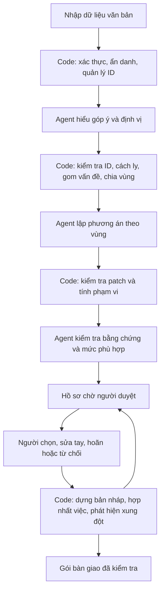

# Kế hoạch triển khai Revision Planner

Ngày khảo sát và cập nhật: 17/09/2026. Phạm vi: lập kế hoạch triển khai từ repo hiện tại; chưa sửa ứng dụng. Không mở, đọc, phân tích, trích frame hay chạy công cụ trên video. Kết luận dưới đây dựa trên mã nguồn và dữ liệu văn bản/JSON/CSV.

**Ưu tiên mới theo yêu cầu người dùng: hoàn thành luồng chạy thật cho checkpoint 3 bằng dữ liệu hiện có trước. Chấp nhận chất lượng phân tích ban đầu chưa tốt; ghi nhận lỗi trung thực. Người dùng bổ sung dữ liệu chính thức song song, không lấy việc hoàn thiện dữ liệu làm điều kiện bắt đầu tích hợp.**

Nguồn cập nhật: rubric cuộc thi người dùng cung cấp và transcript hướng dẫn CP1–CP3. Theo rubric lớp 3A, CP3 là 16:00 ngày 17/09; CP4 chốt spec/quality bar lúc 21:00 ngày 17/09. Đây là mốc của hướng dẫn, không phải xác nhận nhóm đã nộp hoặc còn bao nhiêu thời gian.

## 0. Kế hoạch ưu tiên checkpoint 3 — thực hiện trước

### Lát cắt một câu

**Người phụ trách sửa video đưa góp ý cùng kịch bản hiện có vào hệ thống, AI xác định vấn đề gắn với câu và đề xuất lời sửa có bằng chứng, người phụ trách duyệt để nhận kịch bản mới cùng danh sách việc cần làm.**

Giữ điểm bắt đầu/kết thúc của luồng mock hiện tại: góp ý + kịch bản → xem vấn đề/bằng chứng → duyệt → xuất. Chưa có artifact CP2 đã nộp và góp ý TA trong cuộc trò chuyện; tạm lấy luồng repo hiện tại làm căn cứ, không khẳng định đó là toàn bộ nội dung nhóm đã nộp.

### Luồng phải chạy thật trước

1. Người dùng chọn bộ D1 hiện có hoặc nhập thêm một góp ý mới bằng ô văn bản. Đọc cả JSON góp ý và khảo sát hiện tại qua adapter có sẵn; chưa cần giao diện upload mọi định dạng.
2. Bấm **Phân tích góp ý** → server tạo `runId`, làm sạch, gọi model thật. Không đọc `ket-qua-mau.json` để thay kết quả.
3. Một agent trả output có schema: phân loại/cách ly phản hồi, vấn đề, feedback IDs, câu liên quan hoặc chưa rõ vị trí, điều chưa chắc và phương án có nội dung thay thế cụ thể.
4. Code kiểm tra ID/patch, tính số người, chia vùng đơn giản và tính phạm vi. UI hiển thị kết quả thật của run vừa xong bằng các màn hình hiện có.
5. Người dùng duyệt một phương án hoặc bỏ/hoãn. Code áp dụng duy nhất patch đã duyệt, tính lại tập câu/cảnh cần làm, hiển thị trước/sau.
6. Xuất JSON/Markdown kịch bản có lời mới thật và danh sách việc; có đường truy ngược về góp ý. Không sửa tay file trung gian để luồng đi tiếp.
7. Mở lịch sử run để đối chiếu đầu vào mới → lần gọi model → kết quả đang hiển thị. Thực hiện golden set qua cùng service mà UI gọi và giữ nguyên toàn bộ kết quả lượt đầu.

### Phạm vi CP3 và phần hoãn

| Làm ngay cho CP3 | Hoãn đến sau khi luồng và lượt đo đầu đã chạy |
|---|---|
| Một agent gọi thật, output có cấu trúc, log đối chiếu được | Tách ba agent interpret/propose/verify và vòng phản biện |
| Tận dụng D1 và UI hiện có; thêm ô góp ý mới, nút chạy, trạng thái và lỗi | Thiết kế lại toàn bộ UI, trang import nhiều bước, upload mọi định dạng |
| Một hoặc hai phương án nếu model tạo được; chọn tối đa một phương án/vùng | Bắt buộc sinh cặp gộp/sửa riêng ở mọi ca phù hợp, tối ưu so sánh nâng cao |
| Đổi lời/chữ màn hình/ý đồ hình trên câu hiện có; before/after rõ | Chèn/xóa câu, đổi khoảng dừng/kiểu đọc và dependency nâng cao |
| Tập thu lại ±1 cho đổi lời, loại trùng, đếm ký tự lời mới; phát hiện hai patch ghi khác cùng field | Dependency graph đầy đủ, nhóm slide, budget nhiều chiều, ảnh hưởng timing chính xác |
| Chọn/bỏ/hoãn, lý do và xuất thật | Trình sửa tay phong phú, nhiều reviewer, xử lý đồng thời nhiều tab |
| Một phiên bản kết quả gắn `runId`; localStorage cho quyết định demo | Postgres, migration, hàng đợi, Redis, vector store, repository nhiều adapter |
| ≥20 test case có expected/pass criteria trước lượt chạy, lưu đủ kết quả | Hoàn thiện ~100 góp ý chính thức và benchmark cùng model |
| Video 30 giây + demo trực tiếp + trace đã làm sạch | Dashboard eval, nghiên cứu user validation và tuyên bố tăng hiệu quả |

Phương án đòi thao tác chưa hỗ trợ được hiển thị “ngoài phạm vi bản CP3 / cần xử lý sau”, không giả vờ đã áp dụng. Bản CP3 là lát cắt đầu tiên của Revision Planner, chưa phải kiến trúc đích hoàn chỉnh.

### Cách nối nhanh trong repo

- Thêm entrypoint riêng `packages/ai/src/agents/revision/index.ts` dùng pattern AI SDK + schema đang có, không import toàn bộ agent GTM và Redis.
- Đặt schema, validator, áp dụng patch và tính việc trong `apps/www/src/lib/revision/` trước; chưa tạo package mới hoặc tổ chức lại monorepo.
- Thêm `POST /api/revisions/analyze`: gọi cùng `analyzeRevision(input, config)` mà eval runner sử dụng. Khóa model/API ở server.
- Model không được cấp tool ghi file/kịch bản/quyết định; nó chỉ trả đề xuất. Code chịu trách nhiệm áp dụng sau duyệt.
- Mỗi kết quả có `runId`, input hash và schema version. Adapter đưa dữ liệu thật vào `/van-de`, trang chi tiết và `/xuat`; bỏ phụ thuộc static params/mock result ở đường chạy này.
- Giữ kết quả đã làm sạch trong session store/localStorage cho demo một người; quyết định dùng khóa theo `runId` và option ID để không áp vào kết quả cũ. Sửa nhánh lưu thất bại để vẫn cập nhật bộ nhớ và báo chưa lưu.
- Log run lưu file phía server cho demo local. Nếu chạy host không lưu file bền, bổ sung tải trace JSON ngay; không bắt việc triển khai database mới chặn CP3.
- Khi model lỗi/thiếu key/timeout/output không hợp lệ: hiện lỗi và thử lại; không fallback âm thầm sang kết quả mẫu. Retry tự động tối đa một lần, cả lần đầu và retry đều có trace.
- Không hardcode số 22/20 vào UI: đó là thống kê của bộ hiện tại; nhập mới phải được đếm lại.

### Những yêu cầu tối thiểu vẫn giữ

Chấp nhận sai về hiểu góp ý/định vị/phương án ở lượt đầu không có nghĩa bỏ kiểm tra dữ liệu thực thi. ID phải tồn tại; patch phải hợp lệ; chỉ sửa khi đã duyệt; không đưa API key/PII/nguyên văn công kích ra UI/log công khai. Phản hồi chưa xác định được vị trí được phép trả “cần xác nhận”. Lỗi đánh giá phải hiện trong kết quả, không bị loại khỏi mẫu số.

Không chờ rà hết sai lệch dữ liệu, xác nhận slide hoặc hoàn thiện đáp án chính thức. Chỉ chặn dữ liệu hỏng cấu trúc khiến không thể chạy an toàn; sai lệch ngữ nghĩa còn lại ghi thành lỗi/giới hạn của lượt đo.

### Golden set và bằng chứng CP3

Rubric yêu cầu **ít nhất 20 test case**, cao hơn mức 10–20 trong video hướng dẫn. 22 feedback hiện có không tự động là 22 test case: mỗi case phải có `caseId`, input hoặc source refs, hành vi mong đợi và điều kiện đạt ghi trước khi chạy.

- Chuẩn bị ngay ≥20 case nhỏ từ bối cảnh D1 và các biến thể nhóm tự viết: đề xuất 8 case thường, 8 case khó, 4 case hiếm. Một case có thể chứa nhiều góp ý, ví dụ phản hồi lặp người hoặc trái chiều.
- Case khó gồm mơ hồ, thiếu vị trí, người gửi lặp, trái chiều, injection, công kích, lỗi kỹ thuật, phản hồi lệch nội dung. Case hiếm có thể kiểm tra ID không tồn tại, câu khoảng lặng, câu biên, hai patch xung đột.
- Rubric R4 còn yêu cầu ≥2 case cho mỗi lớp trong taxonomy ①②③④ và ≥10 case từ chatlog thật. Tài liệu được cung cấp chưa định nghĩa bốn lớp; không tự gán taxonomy rồi tuyên bố đã đáp ứng. Khi có guide/log chính thức, bổ sung mapping và provenance. Ca nhóm tự viết ghi rõ synthetic, không đổi nhãn thành chatlog thật.
- Người dùng bổ sung dữ liệu chính thức song song. Chạy được với bộ tạm trước; đánh dấu chính xác tiêu chí nguồn/phủ lớp còn thiếu. Không coi bộ tạm là đã đạt mọi điều kiện R4.
- Khóa model ID, prompt hash, schema version và cấu hình cho cả lượt. Expected không được gửi cho model.
- Chạy qua service sản phẩm thật, không viết pipeline eval riêng sinh kết quả dễ hơn; kiểm tra riêng UI end-to-end cho luồng chính.
- Giữ mọi case kể cả timeout, schema error, định vị sai, đề xuất chưa tốt. Báo `số đạt / số đã chạy`, `%`, `số đã chạy / tổng số planned` và lỗi ưu tiên theo hậu quả.
- Giữ `run-001` bất biến; sửa rồi chạy `run-002`, không ghi đè, bỏ case khó hoặc đổi tiêu chí để làm đẹp kết quả.
- CP3 đo baseline nội bộ là lượt đầu; benchmark đối chiếu một prompt cùng model là mục tiêu sau CP3, không phải điều kiện phải hoàn thành trước.
- CP4 mới khóa quality bar bằng số trong `spec.md`. CP3 vẫn phải có tiêu chí pass/fail của từng case trước khi chạy.

Artifact dự kiến theo rubric, dùng thư mục **`eval/`**:

```text
eval/
  README.md                    # cách chạy, phần thật/mock, giới hạn dữ liệu
  golden-set.v1.json            # >=20 case, expected, pass criteria, source refs
  runs/cp3-run-001/
    manifest.json              # model/config/prompt/code/input versions
    results.jsonl              # output, pass/fail/error, lý do, traceId mọi case
    summary.md                 # số đạt/tổng đã chạy, %, coverage, lỗi ưu tiên
    traces/                    # trace đã làm sạch, không secrets/datapack
docs/checkpoint-3.md            # lát cắt, trạng thái thật/mock, link artifact/video
```

Không commit nguyên datapack hoặc bản sao của pack để phục vụ eval. Chỉ lưu mã tham chiếu, trích ngắn phù hợp và dữ liệu nhóm tự xây. Cần rà cả JSON được copy sẵn vào `apps/www/src/data` trước khi công khai artifact; việc dùng chúng để chạy local không đồng nghĩa cho phép nộp toàn bộ dữ liệu nguồn. Có thể dùng loader từ pack local và sample nhỏ do nhóm viết. Không tự xóa file hiện tại trong bước chỉnh plan.

Trace công khai gồm run/case ID, input refs/hash hoặc nội dung synthetic đã làm sạch, model, prompt version, thời điểm, status, output hợp lệ, token usage nếu có. Với case bị cách ly chỉ lưu ID/nhãn; không sao chép nguyên văn công kích vào trace.

Video 30 giây dự kiến: 0–5s nhập góp ý mới; 5–10s bấm phân tích và thấy trạng thái gọi thật; 10–20s xem vấn đề/câu/bằng chứng/phương án; 20–26s duyệt và xem bản sửa; 26–30s hiện run ID và số đo lượt đầu. Nếu cắt đoạn chờ phải ghi rõ. Demo trực tiếp mở trace/bảng đủ case và giải thích một lỗi ưu tiên. Không cần tải/phân tích video D1 để chuẩn bị luồng; video 30 giây là quay màn hình sản phẩm do nhóm thực hiện khi luồng đã sẵn sàng.

Hoàn tất CP3 cần cả code chạy thật, bằng chứng đo, video mở được và xác nhận biểu mẫu đúng lớp đã gửi. Không ghi “đã hoàn tất CP3” chỉ vì code chạy local.

## 1. Quyết định sản phẩm

Xây một tính năng **chuẩn bị bản sửa cho video đã có**: người phụ trách nạp góp ý, duyệt từng vùng sửa và xuất gói bàn giao cho phiên bản tiếp theo.

Đơn vị quyết định là **phương án trong vùng sửa**. Đơn vị tổng hợp là **gói phát hành**. AI hiểu và đề xuất; code kiểm chứng cấu trúc, tính công việc, phát hiện xung đột; người duyệt quyết định.

Không xây studio đầy đủ, trang tạo video, trình dựng timeline, chatbot tổng quát hoặc hệ thống quản trị khóa học. Không sinh âm thanh/video. Không mở rộng thành soát toàn bộ kịch bản. Không tự chọn phương án tối ưu thay người duyệt.

Hướng triển khai hiện tại: **nối một agent thật vào luồng có sẵn → duyệt và xuất thật → chạy ≥20 case, giữ lượt đo đầu → chuẩn bị bằng chứng CP3 → mở rộng core và UI sau đó**. Schema và validator chỉ xây đến mức cần cho luồng này. Các mục 2–3 giữ kết quả khảo sát; các mục 4–8 là kiến trúc đích sau CP3, áp dụng trong CP3 chỉ ở phần đã chọn tại mục 0. Không dùng toàn bộ kiến trúc đích làm điều kiện để bắt đầu gọi AI.

## 2. Bản đồ repo và phần có thể dùng lại

| Khu vực | Hiện trạng đã khảo sát | Cách xử lý |
|---|---|---|
| `apps/www` | Next.js 16.1.0, React 19.2.3, Tailwind, shadcn; app mock chạy dữ liệu tĩnh | Giữ nền UI, routing, component và tiếng Việt |
| `src/lib/mock-data.ts` | Ghép kịch bản/timecode, gộp nguồn theo ID, đếm người, lọc bằng từ khóa, tính lân cận bằng Set | Tách thành adapter dữ liệu và các hàm nghiệp vụ độc lập |
| `/van-de`, `/van-de/[id]` | Duyệt từng vấn đề và từng đề xuất riêng lẻ | Chuyển trọng tâm thành vùng sửa chứa nhiều vấn đề |
| `/gop-y`, `/gop-y/gan-co` | Tra cứu bằng chứng; ẩn nội dung đã gắn cờ trong component | Giữ, bổ sung trạng thái định vị, nhiều liên kết vấn đề và lọc nguồn |
| `/xuat` | Tính tổng và xuất JSON | Nâng thành gói phát hành, kiểm tra xung đột, xuất nội dung thực sự đã sửa |
| `use-quyet-dinh.ts` | Lưu quyết định theo đề xuất trong một khóa localStorage | Thay bằng quyết định theo revision + vùng + phiên bản phương án; lưu bền phía server |
| `packages/ai` | AI SDK 6.0.5; pattern output schema và tool context; agent Slack/request/search/analytics/identity của bài toán GTM | Tái sử dụng pattern, tạo entrypoint revision riêng, không nối nguyên agent GTM |
| `packages/database` | Drizzle/Postgres; schema user, request, account, feedback và opportunity | Thêm schema riêng cho revision; không ép vấn đề bài giảng vào bảng feature request |
| `packages/redis` | Yêu cầu biến môi trường ngay khi import | Không kéo vào đường chạy revision nếu chưa cần; tránh import toàn bộ agent cũ |
| `apps/slack-app` | Nhận và xử lý góp ý qua Slack cho GTM | Ngoài phạm vi MVP; nhập dữ liệu file là đủ |
| `apps/www/_removed` | Auth, API, actions, workflow, UI cũ; đã loại khỏi TypeScript app | Chỉ tham khảo pattern; không khôi phục cả hệ thống |
| `skills/ai-agents-the-definitive-guide` | Bộ notebook tham khảo agent, reliability, eval; không phải runtime của ứng dụng | Không chạy notebook hoặc đưa framework mới vào MVP chỉ vì có tài liệu |
| `data/studio-pack/c5-feedbackradar` | Gói nguồn, bảng chi phí, mẫu xuất; bị gitignore | Dùng local, không commit pack; repo chỉ lưu code quy tắc, source refs/trích ngắn và fixture nhóm tự viết |

`apps/www/CLAUDE.md` còn mô tả nhiều thành phần GTM không hoạt động trong app mock. Khi triển khai cần cập nhật tài liệu theo cấu trúc mới, tránh dùng tài liệu cũ làm bằng chứng rằng API/auth/database đã sẵn sàng.

Khảo sát tập trung vào đường dữ liệu, nghiệp vụ, UI và các điểm tích hợp; không phải chứng nhận đã kiểm thử mọi dòng component nền hay các notebook tham khảo. Chưa chạy app/build/test ở bước lập kế hoạch.

## 3. Dữ liệu thực tế và hệ quả thiết kế

| Nguồn | Kết quả kiểm tra | Hệ quả |
|---|---|---|
| `kich-ban-d1.json` | 5 phần, 40 câu, 39 câu có lời; câu 35 dừng 5 giây; tổng 3.637 ký tự theo cách đếm hiện tại | Phải có kiểu câu có lời và câu khoảng lặng riêng |
| `cau-timecode-d1.json/.csv` | 40 bản ghi; không thiếu câu, không lệch lời so với JSON kịch bản; thứ tự start ≤ speech end ≤ scene end hợp lệ | Là nguồn chính cho định vị trên bản gốc |
| Thời lượng | Kịch bản dự kiến 251 giây; timecode cuối 251,2 giây | Phân biệt dự kiến và thời lượng theo dữ liệu mốc |
| `transcript-d1.txt` | 72 đoạn phụ đề | Không dùng số dòng phụ đề làm số câu; cần bảng liên kết đoạn phụ đề ↔ câu qua thời gian |
| `gop-y-mau.json` | 18 góp ý mô phỏng | Không phải phản hồi người học thật |
| `khao-sat-d1.json` | 10 dòng; 6 ID đã có trong nguồn văn bản | Merge theo nguồn/ID, giữ dữ liệu khảo sát bổ sung và provenance |
| Hợp nhất | 22 góp ý, 20 mã người gửi | Không lấy số dòng làm số người |
| `ket-qua-mau.json` | Chỉ 2 vấn đề, 2 đề xuất dựng tay, liên kết 6 feedback ID | Là ví dụ, không phải bộ đáp án đầy đủ hay đầu ra agent |
| `slide-d1.json` | 29 nhóm hình; có nhóm chứa nhiều câu; tự ghi sinh tự động và cần rà tay | Không thay 40 cảnh theo bảng chi phí bằng 29 slide; lưu mức xác nhận riêng |
| Mẫu kịch bản | `n` không trùng và tăng dần; mỗi câu có `loi` hoặc `dungGiay`; chữ màn hình tối đa 40 ký tự | Kiểm tra thay đổi mới theo mẫu, xuất Markdown + JSON |

Ba bản JSON kịch bản, góp ý và kết quả trong app khớp nội dung tương ứng trong gói gốc. Sáu câu gốc có chữ màn hình trên 40 ký tự: 17, 21, 28, 29, 33, 38. Ghi nhận là nợ dữ liệu có sẵn; không tự tạo thêm sáu vấn đề hoặc sửa ngoài phạm vi góp ý. Validator phân biệt lỗi đầu vào có sẵn với lỗi do bản sửa đưa vào.

### Các tình huống phải xử lý trên D1

| Tình huống | ID / vị trí | Hành vi cần có |
|---|---|---|
| Một người gửi nhiều lần | `gy-002`, `gy-003`, `gy-018` cùng `hv-011` | Giữ cả ba bằng chứng, tính một người; thêm `gy-022` thành hai người |
| Phản hồi trái chiều | `gy-005`, `gy-006`, câu 35 | Hiện hai hướng ngắn/dài, không chọn theo số đông |
| Mơ hồ | `gy-001`, `gy-017` | Được để chưa định vị; không gán toàn bộ video cho tiện |
| Khen hoặc chỉ chấm điểm | `gy-004`, `gy-009`, `gy-014`, `gy-019`, `gy-021` | Lưu phản hồi; không biến thành yêu cầu sửa; khen có vị trí dùng làm bằng chứng giữ nguyên |
| Góp ý nhiều ý | `gy-016` | Tách nhận xét câu kết và ý muốn giữ bản đồ; cùng feedback ID |
| Góp ý có thể đã được đáp ứng | `gy-016` muốn thêm nối sang video sau; câu 40 đã có câu nối | Hiện sự lệch giữa phản hồi và kịch bản; hỏi xác nhận phiên bản/nguyên nhân, không thêm câu trùng |
| Nguyên nhân do người góp ý suy đoán | `gy-007`, liên quan định nghĩa câu 14 | Tách vướng mắc được báo cáo khỏi giả thuyết nguyên nhân; “nhiều bạn” không thành nhiều người độc lập |
| Âm thanh/hình ảnh | `gy-008`, `gy-010` | Đưa công việc kiểm tra cho đúng người; không khẳng định đã nhìn/nghe thấy lỗi |
| Nội dung không an toàn | `gy-011`, `gy-012` | Cách ly khỏi lập phương án; chỉ hiện ID, nhãn và lý do trung tính |

Ví dụ token câu 14–17 trong mô tả sản phẩm là giả định, không có trong D1. Demo chính nên dùng vùng phân biệt ứng dụng và mô hình câu 20–23, cộng vùng khoảng dừng câu 35. Vị trí khác chưa có đáp án cần gán nhãn thủ công trước khi dùng chấm điểm.

### Khoảng trống hiện tại cần sửa trước

1. Xuất v2 vẫn giữ `loi` gốc, thêm `deXuatDaDuyet`; chưa áp dụng lời thay thế.
2. Đề xuất hiện tại là chỉ dẫn văn xuôi, không phải patch có before/after.
3. Feedback chỉ có một `vanDeId`, trong khi một phản hồi có thể chứa nhiều ý và liên quan nhiều vấn đề.
4. Chưa có vùng sửa, phương án loại trừ nhau, hoãn kèm lý do, sửa tay, budget hoặc conflict engine.
5. Chưa có pipeline xóa PII cho dữ liệu mới; bộ mẫu vốn đã có mã người giả lập. Lọc từ khóa không đủ làm bảo đảm an toàn.
6. Raw JSON được import qua module cũng dùng phía client. Ẩn câu chữ trong component chưa bảo đảm nội dung bị loại không xuất hiện trong bundle/payload. Cần ranh giới server và DTO đã làm sạch.
7. Phạm vi thu lại đang tính ký tự lời cũ; sau khi thay lời phải đếm trên bản nháp mới. Kiểu đọc hiện cũng mở rộng ±1, trong khi bảng chi phí chỉ nói rõ quy tắc này cho đổi lời; phải ghi thành chính sách tường minh.
8. UI đang nói lỗi kỹ thuật không cần thu/dựng lại như một kết luận chung. Thực tế phải dựa vào tác vụ sửa cụ thể, không suy ra chi phí bằng 0 từ nhãn kỹ thuật.
9. Khi localStorage không ghi được, hook hiện phát sự kiện rồi đọc lại kho cũ, nên nhánh “vẫn cập nhật bộ nhớ” chưa hoạt động như chú thích.

## 4. Kiến trúc core và agent system — đích sau CP3



Đây là workflow hữu hạn với ba vai trò AI, không cần các agent tự phân công hoặc trao đổi không giới hạn. Dùng cùng một model cấu hình được cho bản đầu để đo hiệu quả của hệ thống so với baseline. Chưa quyết định đổi framework hoặc nâng phiên bản thư viện; pattern output schema đã có trong repo là điểm xuất phát.

### Agent 1 — Hiểu và định vị phản hồi

Input: feedback đã ẩn danh, kịch bản gốc, bảng timecode và transcript. Với D1 chỉ 40 câu, cung cấp toàn bộ ngữ cảnh văn bản; chưa cần vector database.

Output theo schema cho từng feedback:

- Các ý riêng biệt: loại vấn đề, điều người học vướng, mục tiêu/khía cạnh cụ thể, chiều ý kiến.
- Sentence ID ứng viên và bằng chứng đối chiếu; `unlocated` nếu chưa đủ căn cứ.
- Tách độ chắc về định vị và độ chắc về nguyên nhân; giải thích ngắn, không hiển thị phần trăm như xác suất đã hiệu chuẩn.
- Nhãn khen/chỉ chấm điểm/nhiễu/công kích/cài lệnh; vùng an toàn để trích dẫn phải trỏ về văn bản đã ẩn danh.
- Trạng thái báo cáo lỗi nội dung: chưa kiểm chứng hoặc có căn cứ từ tài liệu được cấp. Một người báo sai vẫn được giữ để xem xét, không tự kết luận họ đúng.

Code kiểm tra mọi ID, timecode và đoạn trích; model không được tạo ID có vẻ hợp lệ nhưng không tồn tại. Timecode hiển thị lấy từ bảng gốc, không lấy số model tự viết.

### Code — Hình thành vấn đề và vùng sửa

- Một feedback → nhiều observation; nhiều observation → một issue. Mọi liên kết giữ nguyên provenance.
- Gom theo câu/khoảng câu × loại × khía cạnh cụ thể. Chỉ dùng câu × loại dễ gộp hai vướng mắc khác nhau cùng nằm tại một câu.
- AI chuẩn hóa khía cạnh và chiều nhận xét; code gom và đánh dấu các chiều đối lập cùng khía cạnh. Không thể phát hiện bất đồng ngữ nghĩa chỉ bằng số đếm.
- Đếm sender ID độc lập trong từng issue; không cộng lại số người của các nhóm để tính toàn vùng.
- Không dùng ngưỡng hai người để xóa các vấn đề một người báo; lỗi nội dung được giữ rõ ràng dù chỉ một người.
- Lập đồ thị interval: hai issue chồng lấn hoặc liền kề nối nhau; mỗi thành phần liên thông thành một vùng. Mỗi issue vẫn là mục riêng trong vùng.
- Observation chưa định vị vào hàng “Cần xác nhận vị trí”, không kéo toàn bộ kịch bản thành một vùng lớn.
- Không dùng phạm vi công việc dây chuyền để gom vùng: vùng dựa vào vị trí vấn đề; dependencies có thể vượt ranh giới vùng.

### Agent 2 — Lập phương án theo vùng

Input: các issue của vùng, bằng chứng đã lọc, bất đồng, kịch bản và câu lân cận cần thiết, điều chưa biết, quy tắc biên tập.

Output: không quá hai phương án chỉnh sửa thực sự khác nhau; cho phép không có phương án sửa nếu thiếu bằng chứng. Hoãn/giữ nguyên là lựa chọn quyết định luôn sẵn có, không phải câu chữ được tự áp dụng.

Mỗi phương án gồm lời/hình/chữ thay thế cụ thể, patches, issue dự kiến giải quyết, issue giải một phần hoặc còn lại, lý do, giả định và yêu cầu người kiểm tra. Nếu đề xuất cách gộp nhiều sửa thì phải có phương án sửa riêng để so sánh; nếu không tạo được đối chứng hợp lý, trả lại để sửa phương án, không mặc định ưu tiên gộp.

Agent không có tool ghi kịch bản, lưu quyết định hay xuất bản. Nếu cần tool, chỉ cấp đọc câu/bằng chứng và `previewImpact` chạy code trên patch tạm. Budget không được dùng để giấu vấn đề hoặc bỏ bằng chứng.

### Agent 3 — Kiểm tra phương án

Kiểm tra tính liên quan của lời sửa với trở ngại được phản ánh; độ khác biệt giữa A/B; tuyên bố giải quyết có quá mức không; nhận định hình/âm có được ghi là chưa xác nhận không; nguyên nhân có bị biến từ giả thuyết thành sự thật không.

Output: pass, cần sửa hoặc cần người xác nhận, kèm ID và lý do. Không có quyền duyệt. Cho tối đa một vòng sửa phương án tự động; quá số lần thì giữ hồ sơ “Cần kiểm tra”, không lặp vô hạn.

Code mới là nơi kiểm tra schema, liên kết, ranh giới quyền ghi, phép áp dụng patch, chi phí, và xung đột. Agent kiểm tra không thay được các ràng buộc đó.

### Vận hành và ranh giới dữ liệu

- Lưu run ID, input hash, model/prompt/schema version, trạng thái bước, thời gian và token usage; không ghi raw PII hay nguyên văn công kích vào log, báo cáo, DevTools hoặc UI.
- Dữ liệu không tin cậy luôn nằm trong input data; không ghép thành system instruction. Agent chỉ nhận feedback đã qua ẩn danh; bước lập phương án chỉ nhận observation đã qua lọc.
- Luật tiền xử lý bắt trường hợp rõ; agent phân loại thêm. Không tuyên bố lọc injection tuyệt đối. Quyền ghi bị chặn độc lập với việc phân loại đúng hay sai.
- PII ở trường định danh được thay bằng mã ổn định trong dự án; nội dung tự do cần detector và kiểm thử riêng, không hứa regex xóa được mọi tên riêng. Trường hợp chưa xác nhận việc làm sạch giữ lại để kiểm tra trước khi gửi model.
- HMAC/mapping từ định danh nguồn chỉ dùng nội bộ; không coi hai người có tên giống nhau là một, không tự nối danh tính khác kênh khi thiếu khóa đáng tin. Hiện rõ nếu chưa xác minh được số người độc lập.
- Chạy lại bước lỗi từ checkpoint; không nhân đôi feedback hoặc ghi đè quyết định đã duyệt. Dữ liệu/phiên bản phương án đổi thì quyết định liên quan cần duyệt lại.
- Không gọi AI lại khi chỉ chọn A/B hoặc đổi budget: việc đó chạy code và cập nhật gói ngay.

## 5. Hợp đồng dữ liệu đích — triển khai tăng dần sau CP3

| Entity | Trường chính |
|---|---|
| `ScriptVersion` | id, projectId, sourceVersion, title, sections, sentences, sourceHash |
| `Sentence` | stableId, n, sectionId, loi hoặc dungGiay, kieu, chuTrenManHinh, yDoHinh |
| `SourceTiming` | scriptVersionId, sentenceId, start, speechEnd, sceneEnd |
| `SubtitleSegment` | id, source start/end, text, sentenceIds, mappingStatus |
| `Feedback` | id, sourceRefs, pseudonymousSenderId, sanitizedText, survey, moderationStatus |
| `Observation` | feedbackId, safeSpan, aspectKey, stance, category, candidateSentenceIds, locationStatus, uncertainty |
| `Issue` | observationIds, sentenceIds, category, aspectKey, severityReason, stanceGroups, independentSenderCount |
| `RevisionRegion` | issueIds, orderedSentenceIds, boundary, version |
| `Option` | regionId, version, evidenceIds, patches, coverageByIssue, assumptions, requiredChecks |
| `Patch` | operation, targetStableId/anchorId, field, expectedBefore, after, issueIds, evidenceIds |
| `Decision` | revisionId, regionId, optionVersion, selected/custom/deferred/rejected/keep, reason, reviewer, timestamp |
| `ReleaseSnapshot` | baseVersion, decisionsVersion, patchedScript, taskSets, conflicts, unresolvedIssues, budgetStatus |
| `WorkItem` | kind, targetId, reasonEdges, sourceOptionIds, confirmationStatus |

Patch hỗ trợ replace field, insert sentence, delete sentence, đổi khoảng dừng, và yêu cầu công việc kỹ thuật như kiểm tra âm/mốc phụ đề. Giữ nhóm patch nguyên tử cho một phương án; không áp dụng nửa phương án rồi ghi là hoàn thành.

Stable ID không đổi khi chèn/xóa. Khi xuất đánh lại `n` tăng dần, kèm bảng ánh xạ `stableId → n gốc → n mới`. Bằng chứng và mốc phát lại tiếp tục trỏ bản gốc. Không gắn timecode cũ lên lời mới như thể đó là thời gian đã đo.

## 6. Release engine đầy đủ: phần chứng minh “ít làm lại” sau CP3

Tách thành các hàm thuần, không phụ thuộc model, React hay database:

`validatePatch → applyApprovedPatches → deriveDependencies → unionWorkItems → detectConflicts → checkBudgets → buildExport`.

### Quy tắc tính việc

| Thay đổi | Thu âm | Hình/cảnh | Phụ đề/thời gian |
|---|---|---|---|
| Đổi lời câu N | N và câu kề có lời theo chính sách ngữ cảnh | Cảnh của các câu thu lại | Đổi nội dung N, kiểm tra timing các câu liên quan |
| Đổi kiểu đọc | Thu lại câu đó; mở rộng chỉ nếu chính sách nguồn yêu cầu | Dựng lại cảnh tương ứng | Căn lại timing |
| Đổi ý đồ hình/chữ màn hình | Không thu lại nếu lời không đổi | Cảnh tương ứng | Không đồng nhất chữ màn hình với phụ đề |
| Thêm câu | Thu mới; kiểm tra câu có ngữ cảnh trước/sau thay đổi | Cảnh mới và dependency cần thiết | Nội dung mới, dịch/căn mốc sau điểm chèn |
| Xóa câu | Không thu câu đã xóa; xét các câu còn lại có ngữ cảnh đổi | Bỏ cảnh và cập nhật ghép nối | Bỏ đoạn tương ứng, dịch/căn mốc |
| Đổi thời gian dừng | Không có lời để thu | Cập nhật thời lượng cảnh dừng | Dịch/căn timing phía sau |
| Sửa kỹ thuật | Theo thao tác đã xác nhận; có thể chưa xác định | Theo thao tác, không mặc định zero | Tác vụ riêng: căn phụ đề, chỉnh mix… |

Bảng chi phí nêu rõ ±1 cho đổi lời, chưa đặc tả hết chèn/xóa, kiểu đọc và khoảng lặng. Các quy tắc mở rộng phải có policy version và nhãn giả định; không trình bày chúng như quy tắc đã được ban tổ chức xác nhận. Mặc định bảo thủ: xét láng giềng trước và sau phép chèn/xóa, không tự bỏ qua câu khoảng lặng để lan sang xa hơn nếu chưa có quy tắc.

Dependency không lan vô hạn: câu kề được thu lại với lời không đổi không tự làm phát sinh ±1 thêm lần nữa. Ngữ cảnh dùng lời câu, không dùng việc câu đó có nằm trong danh sách thu lại hay không.

- Thu lại, thu mới, dựng cảnh, cập nhật phụ đề, kiểm tra kỹ thuật và dịch mốc là các tập công việc khác nhau.
- Hợp nhất theo loại việc × stable target ID. Một câu chịu ảnh hưởng từ hai phương án vẫn chỉ thu một lần, nhưng giữ cả hai lý do.
- Ký tự phải thu tính trên lời sau khi áp dụng patch; so sánh với 3.637 ký tự gốc. Quy ước Unicode được khóa và dùng chung trong app/eval.
- Số cảnh chính theo câu, đúng bảng chi phí. Nhóm slide chỉ là dữ liệu phụ có trạng thái chưa xác nhận.
- Ước lượng thời lượng mới có thể dựa trên hướng dẫn 2,9 tiếng/giây và kiểu đọc, nhưng luôn ghi là ước lượng. Không xuất phụ đề v2 với timing “chính xác” khi chưa có audio mới.
- Dịch mốc các cảnh phía sau không đồng nghĩa phải dựng lại tất cả các cảnh đó.
- Budget gồm trần câu thu lại, câu thu mới, ký tự và/hoặc cảnh. Không tự đổi ra tiền.

### Xung đột và ảnh hưởng chéo

| Loại | Ví dụ | Xử lý |
|---|---|---|
| Ghi khác giá trị vào cùng field | Hai patch sửa lời cùng câu | Chặn áp dụng cùng lúc; cho chọn lại hoặc tạo bản hợp nhất người duyệt |
| Xóa/chèn làm mất đích | Xóa câu đang được patch khác sửa hoặc làm anchor | Chặn, chỉ rõ patch liên quan |
| Patch cũ | `expectedBefore` không còn khớp | Yêu cầu tái kiểm tra và duyệt lại |
| Dependency chạm vùng khác | Sửa lời câu 22 làm câu 23 thu lại, câu 23 có phương án khác | Hiện ngay ảnh hưởng chéo; tính lại preview của vùng liên quan |
| Cùng dùng tài nguyên nhưng tương thích | Đổi lời và đổi chữ màn hình cùng cảnh | Gộp việc, không tạo conflict cứng giả |
| Điều kiện xác nhận chưa xong | Phương án sửa hình chưa được người kiểm tra đoạn video | Gói còn việc chờ xác nhận; không đánh dấu đã sẵn sàng sản xuất |

Các vùng gộp hết các issue liền kề, nên ví dụ hai vùng rời nhau tại 17/18 không phù hợp nếu cả hai đều có issue nằm sát nhau. Ca kiểm thử ảnh hưởng chéo nên dùng hai vùng có ít nhất một câu cách: sửa câu 22 và 24 cùng kéo theo câu 23; thêm fixture patch mở rộng ra ngoài vùng để kiểm tra conflict ghi cùng field. Phải chứng minh cả hợp nhất đúng lẫn không báo xung đột giả.

Khi bấm xem thử phương án chưa chọn, tính cả tổng riêng và **phần việc tăng thêm trong gói hiện tại**. Khi chọn, lưu quyết định và snapshot theo transaction/version; không để hai lần bấm hoặc hai tab ghi đè âm thầm.

## 7. UI đích dành riêng cho kịch bản Revision Planner — sau luồng CP3

Khung nhỏ gọn: `Video D1 / Chuẩn bị bản v2`, trạng thái đã lưu, 3 mục chính **Dữ liệu góp ý · Duyệt vùng sửa · Gói bàn giao**. Tra cứu góp ý gắn cờ là bộ lọc phụ. Không có menu tạo kịch bản, sinh video, thư viện media hay màn hình studio giả.

### Màn 1 — Dữ liệu góp ý

- Có nút dùng bộ D1 mẫu; nhận JSON góp ý, CSV khảo sát và văn bản dán. Kịch bản/timecode/transcript là input của video đã có.
- Preview số bản ghi hợp lệ, bản trùng, thông tin đã ẩn, bản ghi lỗi và vị trí lỗi. Không bắt người dùng học schema nội bộ.
- Khi thiếu mã người gửi, không khẳng định số người độc lập chính xác; cho sửa mapping.
- Trạng thái thực của các bước: kiểm tra dữ liệu → phân tích góp ý → lập hồ sơ. Hiện kết quả từng phần và nút thử lại bước lỗi.
- Góp ý mới trong demo được thêm vào đợt hiện tại, phân tích lại phần liên quan; quyết định cũ chỉ bị đánh dấu cần duyệt lại khi hồ sơ của nó thay đổi.

### Màn 2 — Duyệt vùng sửa, màn hình trung tâm

Desktop: danh sách vùng bên trái; hồ sơ vùng ở giữa; tóm tắt gói bên phải hoặc thanh cố định phía dưới. Màn nhỏ xếp thành từng phần, vẫn giữ thanh quyết định.

Một hồ sơ đọc theo thứ tự:

1. Người học đang vướng gì; câu và mốc trên bản gốc; số người độc lập, số lần nhắc.
2. Bằng chứng có ID, nhóm người gửi, hai chiều ý kiến; bấm mở đúng đoạn kịch bản/phát lại khi người dùng cần.
3. “Điều chưa rõ”: vị trí, giả thuyết nguyên nhân, phản hồi không khớp phiên bản, hình/âm chưa kiểm chứng.
4. A/B so sánh ngang: nội dung trước/sau, vấn đề dự kiến giải, vấn đề còn lại, số câu thu lại/thu mới, cảnh, phụ đề và phần việc tăng thêm.
5. Chọn A/B, chỉnh tay rồi duyệt, giữ nguyên, hoãn hoặc từ chối. Hoãn/từ chối ghi lý do ngắn. Không chọn sẵn A.

Mỗi câu bị kéo theo có nhãn lý do, ví dụ “Thu lại vì lời câu 22 đổi”. Bất đồng và điều chưa rõ không giấu trong tooltip. Dùng chữ và biểu tượng cùng màu để người dùng không phải phân biệt chỉ bằng màu.

Preview trước khi duyệt không sửa bản nháp chính. Sau duyệt, hiện tổng việc mới, xung đột hoặc vượt giới hạn ngay. Chỉnh tay làm mất hiệu lực lần duyệt cũ và chạy lại validator; không âm thầm giữ trạng thái đã duyệt.

Player kế thừa khả năng seek/stop của component hiện có, nhưng chỉ gắn nguồn/tải khi người dùng yêu cầu; lỗi video vẫn đọc được transcript. Trong quá trình phát triển và kiểm tra UI theo yêu cầu hiện tại dùng stub player, không tải video nặng.

### Màn 3 — Gói bàn giao

- Danh sách “Đã chọn để xử lý”, “Giải quyết một phần”, “Chưa xử lý”: gồm chờ duyệt, hoãn, từ chối, giữ nguyên và chưa định vị. “Đã chọn” không có nghĩa đã chứng minh người học hết vướng.
- Kịch bản trước/sau theo câu; danh sách thu âm, dựng hình, phụ đề, kỹ thuật. Cho truy ngược từng việc tới option → issue → feedback.
- Budget bar hiển thị đơn vị cụ thể; vượt trần cho điều chỉnh lựa chọn hoặc chủ động thay giới hạn kèm ghi nhận.
- Khu vực xung đột chỉ rõ câu, vùng và hai lựa chọn; có đường quay lại hồ sơ.
- Tách “Tải bản nháp có cảnh báo” và “Xuất gói đã chốt”. Gói đã chốt yêu cầu không có conflict cứng, patch hợp lệ, xác nhận bắt buộc hoàn tất và trạng thái unresolved được ghi đầy đủ.
- File bàn giao: `kich-ban-v2.json`, `kich-ban-v2.md`, `thu-am.csv`, `dung-hinh.csv`, `phu-de.csv`, `quyet-dinh-va-bang-chung.json`; tác vụ kỹ thuật có danh sách riêng nếu phát sinh.
- Bảng phụ đề ghi nội dung/tác vụ và tham chiếu timing gốc; không giả tạo SRT cuối cùng cho audio chưa thu.

## 8. Tổ chức mã nguồn và API đích — chưa refactor toàn bộ cho CP3

```text
packages/revision-core/src/
  schemas.ts             # hợp đồng dữ liệu dùng chung
  ingest.ts              # parse, provenance, dedup, pseudonymization
  issues.ts              # nhóm observation, sender count, disagreement
  regions.ts             # chia vùng theo interval
  patches.ts             # validate/apply approved patches
  impact.ts              # dependency và hợp nhất công việc
  conflicts.ts           # hard conflict và cross-region warning
  export.ts              # xuất đúng mẫu và bảng bàn giao
packages/ai/src/agents/revision/
  interpret.ts
  propose.ts
  verify.ts
  prompts.ts
  index.ts
apps/www/src/lib/revision/
  repository.ts          # dữ liệu server, version và transaction
  service.ts             # điều phối core + agent
  dto.ts                 # chỉ trả dữ liệu được phép hiển thị
apps/www/src/app/api/revisions/
apps/www/src/components/revision/
eval/revision/
  fixtures/ labels/ runners/ reports/
```

API đề xuất: tạo revision/import; bắt đầu analysis; đọc run status; đọc vùng; preview option; lưu decision có expected version; đọc release snapshot; export. Tất cả đặt dưới một revision ID. Server tính lại snapshot có thẩm quyền; client có thể preview lạc quan nhưng phải đồng bộ kết quả server. Các hook lấy dữ liệu dùng SWR theo pattern của repo.

Tạo `RevisionRepository` với adapter fixture cho phát triển và Postgres/Drizzle cho demo tích hợp. Các bảng tối thiểu: revisions, feedback, analysis_runs, region_cases/options, decisions, release_snapshots; dữ liệu lồng có thể lưu JSONB có schema version trong MVP. Không cần thêm queue/vector store cho 22–100 góp ý; checkpoint lưu bền và endpoint resume đủ làm bước đầu. Trước triển khai host cụ thể cần kiểm tra giới hạn thời gian request, chuyển job sang worker nếu cần.

## 9. Thứ tự thực hiện đã điều chỉnh cho CP3

Bỏ lộ trình 12–18 ngày công làm kế hoạch trước mắt. Làm theo từng điểm kiểm tra chạy được, không dành một giai đoạn riêng để sửa dữ liệu trước khi tích hợp AI. Chưa ước lượng giờ hoàn thành khi chưa kiểm tra cấu hình model và môi trường chạy.

| Thứ tự | Công việc | Điều kiện xong |
|---|---|---|
| CP3-1 | Schema output tối thiểu, cấu hình model server, agent revision, endpoint + run trace | Gửi một góp ý mới, nhận kết quả model thật có runId; không cần đổi UI lớn |
| CP3-2 | Nối kết quả run vào danh sách/chi tiết hiện tại; loading/error/retry, bằng chứng và chưa rõ vị trí | Người dùng đi từ nút chạy đến hồ sơ của chính input đó, không dùng JSON kết quả mẫu |
| CP3-3 | Duyệt patch, tính công việc tối thiểu, loại trùng, xuất nội dung mới | Bấm duyệt rồi tải file thấy lời đã đổi; chưa duyệt không đổi; xung đột ghi cùng field bị chặn |
| CP3-4 | Golden set ≥20 case, đóng băng expected/config, runner cùng service, bảng đủ kết quả | Có results + trace + số đạt/tổng đã chạy + %, kể cả lỗi; xác định một nhóm lỗi ưu tiên |
| CP3-5 | Demo đầu vào mới, quay 30 giây, kiểm tra link, điền số đo thực vào artifact nộp | Bằng chứng mở được; nhóm gửi đúng biểu mẫu và kiểm tra xác nhận |
| Sau CP3 → CP4 | Dùng lỗi lượt đầu và dữ liệu người dùng bổ sung để chỉnh spec/phạm vi, khóa quality bar | `spec.md` có ngưỡng bằng số được commit trước hạn CP4, nêu phần còn thiếu |
| Sau khi chốt spec → CP5 | Sửa lỗi ưu tiên, chạy lượt mới, hoàn thiện tính năng đúng phạm vi đã chốt và bộ bàn giao | So sánh run-001/run-002 trung thực; demo/slide và video dự phòng |

Song song do người dùng/nhóm chuẩn bị: dữ liệu chính thức, provenance chatlog, mapping bốn lớp chỗ khó, expected và nhận xét TA. Đội triển khai giữ adapter/version để nhận dữ liệu bổ sung; không đợi bộ này hoàn chỉnh mới chạy agent. Những dữ liệu thay đổi dùng bộ/run version mới, không sửa lịch sử lượt đầu.

Nếu phải giảm phạm vi: bỏ trước phần trang trí UI, database, thêm/xóa câu, multi-agent và benchmark nâng cao. Giữ lời gọi AI thật, input mới, trace, một kết quả sửa thiết yếu, duyệt, export, golden set và kết quả đủ case. Nếu không chạy hết, báo chính xác phần chưa chạy; không tuyên bố đã đủ checkpoint.

## 10. Đánh giá đầy đủ sau lượt đầu CP3

Mục này giữ mục tiêu chất lượng dài hơn của sản phẩm. CP3 thực hiện bộ ≥20 case và bảng lượt đầu ở mục 0 trước; không đợi bộ ~100 góp ý hoặc benchmark hoàn chỉnh. **Một feedback không đồng nghĩa một test case.** Mục tiêu ~100 góp ý của đề và ≥20 case của rubric là hai đơn vị khác nhau.

### Bộ dữ liệu

Khoảng 100 góp ý mô phỏng bám D1, không dùng người học thật. Có nhiều ca mỗi nhóm: mơ hồ, trái chiều kể cả lệch số người, lặp người khác kênh, injection diễn đạt khác nhau, công kích, lỗi kỹ thuật; bổ sung báo sai nội dung một người, khen/chỉ điểm, góp ý nhiều ý, phản hồi lệch phiên bản.

Label gồm observation, issue group, sender identity, loại/chiều ý kiến, sentence set hoặc unlocated, vùng, các hướng sửa chấp nhận được, phạm vi công việc đúng và provenance. Không bắt chỉ một câu viết lại là đáp án đúng. Thêm fixture quyết định/patch để cài xung đột có kiểm soát; xung đột không chỉ nằm trong văn bản góp ý.

Chia phát triển/kiểm tra theo nhóm tình huống hoặc họ paraphrase, không chia ngẫu nhiên từng câu gần giống. Giữ tập kiểm tra chưa dùng chỉnh prompt; nếu chỉ có D1 thì báo giới hạn khái quát sang video khác. Đáp án cần người rà soát; không dùng chính agent sinh phương án làm giám khảo duy nhất.

### So sánh công bằng

Baseline: cùng model và phiên bản, cùng dữ liệu đã ẩn danh, kịch bản/timecode/transcript, bảng chi phí và yêu cầu output tương đương, prompt “đọc góp ý và kịch bản, lập kế hoạch sửa”. Không đưa labels hay `ket-qua-mau.json` cho một bên. Ghi token budget, số lời gọi, độ trễ, lỗi và chạy lặp để thấy biến thiên; hệ thống nhiều bước không được gọi là rẻ hơn nếu chưa đo.

Đo cả (a) chất lượng đề xuất thô của baseline so với pipeline và (b) baseline đi qua cùng impact engine để tách lợi ích tính toán bằng code khỏi lợi ích hiểu dữ liệu của agent. Với phạm vi sửa, dùng một chính sách chọn phương án cố định hoặc quyết định do người gán nhãn cung cấp; không chọn phương án đẹp nhất sau khi xem đáp án.

| Mục tiêu | Cách đo |
|---|---|
| Tìm đúng và đủ vấn đề | Issue precision/recall/F1, quy tắc ghép dự đoán ↔ label rõ ràng; báo riêng lỗi nội dung một người |
| Định vị | Exact sentence-set match, precision/recall hoặc IoU của tập câu; độ đúng của quyết định chưa định vị |
| Ít sửa thừa | Sai số số câu thu lại + false-positive/false-negative sentence IDs; thêm ký tự/cảnh, tránh chỉ so tổng bằng nhau |
| Xung đột | Precision/recall trên fixture conflict; báo riêng hard conflict và dependency warning |
| Bất đồng | Tỉ lệ nhận diện đúng, giữ đủ hai chiều và không tự chọn theo đa số khi thiếu cờ |
| Truy nguyên | 100% option/patch có evidence ID tồn tại và không bị cách ly; kiểm tra thêm sự liên quan ngữ nghĩa bằng rubric |
| Làm sạch/an toàn | PII lọt vào payload; false positive/negative của moderation; flagged lọt planner; thao tác ghi trái quyền |
| Tính đúng gói | Không trùng việc, không patch chưa duyệt, không sửa ngoài scope, bản xuất khớp snapshot |

100% trace ID tồn tại là điều kiện cần, không chứng minh trích dẫn thực sự hỗ trợ đề xuất. Chất lượng ngữ nghĩa phải có đánh giá riêng. Chỉ kết luận “tốt hơn baseline” trên các số đo đã chạy; mục tiêu precision/recall cụ thể chốt sau lần đo đầu, không bịa tỷ lệ thành công.

### Kiểm thử bắt buộc theo hành vi

- Sửa câu 20 → thu 19/20/21; sửa 20 và 21 → 19/20/21/22, không thành 6 câu.
- Hai phương án chạm cùng dependency → gộp một công việc, giữ hai lý do.
- Đổi lời 22 → phạm vi 21/22/23; 269 ký tự chỉ đúng với lời gốc, sau patch phải tính lại.
- Câu đầu/cuối, khoảng lặng 35, chèn/xóa, đảo số thứ tự; không tạo ID/timing giả.
- Chọn B thay A → gỡ toàn bộ patch/work chỉ thuộc A; không để sót công việc.
- Chưa duyệt hoặc hoãn → không đổi lời; sửa tay → cần duyệt lại.
- Import trùng, run retry, hai tab quyết định đồng thời, model output sai schema/ID, thiếu cấu hình model.
- Nội dung công kích không có trong API hiển thị, bundle dữ liệu, log hoặc export.
- Export đọc lại được, đúng mẫu, links truy nguyên đầy đủ; video player được mock trong E2E để không tải video.

### Demo đề xuất

Nạp D1 → thấy 22 góp ý từ 20 người → mở vùng 20–23 → thấy bốn góp ý nhưng hai người → so sánh hai phương án có lời sửa cụ thể → xem phần việc tăng thêm → chọn → mở vùng 35 có trái chiều và hoãn → chạy ca ảnh hưởng chéo/conflict được gắn nhãn là fixture kiểm thử → thêm góp ý mới tại chỗ → xuất kịch bản v2 và danh sách việc, mở file chứng minh lời thực sự đã thay.

## 11. Quyết định mặc định cho lần triển khai tiếp theo

Mặc định: tiếng Việt, một người duyệt, D1 hiện có, một agent chạy thật, không phân tích hình/âm, dùng stack và UI hiện tại, demo local trước, đơn vị công việc theo câu/ký tự, giữ bản gốc bất biến. Dữ liệu có thể chưa chính xác và đang được bổ sung song song.

Điều kiện kỹ thuật cần kiểm tra ngay khi bắt đầu code: model/provider và API credential dùng được phía server. Không đọc hoặc in secret vào log. Thiếu cấu hình thì báo đúng chỗ thiếu, vẫn làm adapter/schema/UI/runner độc lập; không biến kết quả mẫu thành “AI thật”. Chưa cần chọn Postgres hoặc chốt quy tắc chèn/xóa để bắt đầu CP3.

**Việc làm đầu tiên: CP3-1 — thêm agent revision và endpoint phân tích thật, chạy một input mới có trace; tiếp đó nối UI, duyệt/export, rồi chạy bộ ≥20 case.** Kế hoạch này chưa xác nhận có lời gọi AI, kết quả đo, video hay biểu mẫu nộp nào đã hoàn thành.
