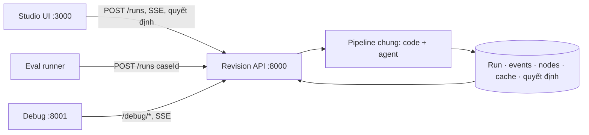

# Kế hoạch chỉnh sửa: tách Revision service, pipeline node cố định kiểu Dify, trang debug và eval dùng chung một pipeline

Ngày: 17/09/2026, sau khi nộp MVP. Thay thế phần kiến trúc và trạng thái của `docs/agent-pipeline-ui-plan.md` (các mục 3.2, 6, 6b, 7). Các trang sản phẩm đã thống nhất trong `docs/revision-planner-spec.md` (thư viện, xem video, kịch bản chi tiết, góp ý, đề xuất chỉnh sửa, bản sửa, phiên bản) **giữ nguyên**; kế hoạch này chỉ thay tầng kỹ thuật phía sau và cách hiển thị pipeline.

## 0. Hai yêu cầu dẫn tới kế hoạch này

1. **Pipeline phải là sơ đồ node cố định, luôn hiện, sáng dần theo tiến trình như Dify.** Hiện sơ đồ chỉ vẽ những node đã chạy xong, chỉ có ở trang debug và không cập nhật trực tiếp.
2. **Tách phần chạy agent khỏi UI sản phẩm.** UI, service chạy pipeline và trang debug/eval là ba thành phần khác nhau. Chạy agent ở port riêng không tự tạo ra trang debug; và **UI, debug, eval phải dùng chung đúng một pipeline**.

## 1. Kiểm tra lại hiện trạng — sửa các đánh giá sai trước đó

Kiểm tra mã ngày 17/09. Một số mục trong `agent-pipeline-ui-plan.md` đã bị đánh dấu ✅ nhưng **không đạt tiêu chí của chính plan đó**. Ghi lại để không tiếp tục dựa vào đánh giá sai.

| # | Đã ghi trước đó | Thực tế | Bằng chứng |
|---|---|---|---|
| 1 | P1 ✅ "danh sách vùng xuất hiện trước khi phương án xong" | **Không đạt.** `cases.ready` phát sau khi mọi lời gọi lập phương án xong. Đo được: phân loại xong giây 50 nhưng `cases.ready` ở giây 101 | `background-runner.ts`: nhóm vùng dòng 530, `await Promise.all(workers)` dòng 683, `cases.ready` dòng 732 |
| 2 | P2 "đã có vòng sửa theo lỗi V1/V2" | **Không đạt.** Chỉ có retry khi output sai schema. Validator chạy **một lần ở cuối** cho toàn bộ kết quả; lỗi patch không quay lại lời gọi của vùng đó | `validateRevisionOutput(` chỉ ở dòng 720; `run-step.ts` retry theo lỗi parse |
| 3 | "UI, debug, eval dùng chung pipeline" (ngầm định) | **Sai.** Có **hai pipeline**: UI chạy `background-runner.ts` (tách N4/N8), còn eval runner và `?sync=1` chạy `service.ts` (một lời gọi, prompt cũ). Golden set nếu chạy sẽ đo pipeline người dùng không dùng | `scripts/eval-cp3.ts:5` import `analyzeRevision` từ `service.ts`; `analyze/route.ts:56` nhánh `isSync` |
| 4 | Màn chờ P0c ✅ | **Hỏng sau P1.** Danh sách bước cố định vẫn là node cũ `MODEL_PHAN_TICH` (không còn chạy); các node `N4_PHAN_LOAI`, `N8_LAP_PHUONG_AN_k` được chèn thêm động ở cuối. Người dùng thấy một bước "Gọi AI" mãi "chưa chạy" | `analysis-progress-panel.tsx:41` `DEFAULT_NODES` |
| 5 | Sơ đồ pipeline "Đạt" | **Chưa đúng yêu cầu.** Chỉ vẽ node đã có dữ liệu (đã chạy), không có định nghĩa đồ thị cố định; chỉ render một lần phía server, không nhận SSE; chỉ có ở `/dev/runs/[runId]`, không có ở màn người dùng | `pipeline-graph.tsx:68` lọc theo node đã tồn tại; `run-inspector-client.tsx` không có `EventSource` |
| 6 | Người duyệt quyết định | **Chỉ ở client.** Quyết định lưu `localStorage`; không có API quyết định; client tự tính gói bản sửa bằng engine | `use-quyet-dinh.ts:118`; `videos/[id]/page.tsx:48,205` import và gọi `computeReleaseSnapshot` |
| 7 | Tách agent | **Chưa tách.** Agent, pipeline, lưu trữ, debug đều nằm trong Next.js `apps/www` | `apps/www/src/lib/revision/*`, `apps/www/src/app/api/revisions/*` |
| 8 | Bảo vệ trang debug | **Chỉ bằng cờ env** trên cùng app sản phẩm | `dev/runs/page.tsx:9` |
| 9 | Golden set | **Chưa chạy thật.** `cp3-run-001/005/007` và `test-*` đều `mock-agent` | `eval/runs/*/manifest.json` |

Điều vẫn đúng và giữ lại: chạy nền trả `202`; `events.jsonl` + SSE; nhịp báo sống mỗi 5 s; cache node (đầu vào không đổi 0,2 s; thêm 1 góp ý chỉ gọi 2/13 node); chạy lại một node; so sánh hai run; tách tab Kịch bản chi tiết khỏi kết quả AI.

## 2. Kiến trúc đích

### 2.1 Ba thành phần

| Thành phần | Port local (đề xuất) | Người dùng | Trách nhiệm | Không làm |
|---|---|---|---|---|
| **Studio UI** — `apps/www` | 3000 | Người phụ trách video | Thư viện, xem video, kịch bản chi tiết, góp ý, **tiến trình pipeline dạng node**, duyệt phương án, bản sửa, tải gói | Không giữ prompt, API key; không tự quyết quy tắc chi phí (chỉ được xem trước, server xác nhận) |
| **Revision service** — `apps/revision-service` | 8000 | UI, eval runner, debug | Điều phối pipeline (agent + code), lưu run/sự kiện/node, cache, quyết định, tính gói bản sửa, xuất file | Không có giao diện |
| **Debug & Eval** — `apps/revision-debug` | 8001 | Kỹ sư | Canvas pipeline trực tiếp, thanh tra node, chạy lại, so sánh, bảng golden set | Không chứa logic pipeline riêng; chỉ đọc/gọi service |

Port là đề xuất cho local, không bắt buộc. Có thể thay `apps/revision-debug` bằng route `/debug` do service phục vụ; khi đó vẫn tách quyền truy cập (mục 4.3).

### 2.2 Luồng tổng thể



**Nguyên tắc bất biến:** chỉ có **một** hàm chạy pipeline (`runPipeline`) trong `packages/revision-core`. UI, eval và "chạy lại" trong debug đều đi qua `POST /runs` của service. Xóa đường `?sync=1` và `service.ts` một-lời-gọi sau khi chuyển xong.

### 2.3 Tổ chức mã

```text
packages/revision-core/          # thuần TypeScript, không phụ thuộc Next
  pipeline/graph.ts              # ĐỊNH NGHĨA ĐỒ THỊ CỐ ĐỊNH (mục 3.1) + graphVersion
  pipeline/run.ts                # runPipeline(input, deps) — nơi duy nhất chạy node
  pipeline/nodes/*.ts            # mỗi node một file: code hoặc gọi agent
  events.ts  node-cache.ts  store.ts (giao diện lưu trữ)
  load.ts sanitize.ts validate.ts cases.ts engine.ts export.ts   # chuyển từ apps/www/src/lib/revision
packages/ai/src/agents/revision/  # giữ nguyên: prompt, schema, run-step
apps/revision-service/            # HTTP + SSE, gọi revision-core, lưu file .data
apps/revision-debug/              # React + canvas đồ thị
apps/www/                         # chỉ gọi service qua REVISION_SERVICE_URL
```

## 3. Pipeline chuẩn: đồ thị cố định

### 3.1 Định nghĩa đồ thị là dữ liệu, không vẽ theo kết quả

Service phát `GET /pipeline` trả định nghĩa dưới đây. UI và debug **vẽ toàn bộ node ngay từ trước khi chạy**, sau đó chỉ tô trạng thái lên. Đổi đồ thị thì tăng `graphVersion`; run cũ vẽ theo đúng `graphVersion` của nó.

```ts
interface PipelineNodeDef {
  id: string;                     // ổn định, không chứa chỉ số lần lặp
  label: string;                  // nhãn cho người dùng
  kind: "code" | "ai" | "iteration" | "human";
  next: string[];
  childOf?: string;               // node con của iteration
  userVisible: boolean;           // hiện ở màn người dùng hay chỉ ở debug
}
```

| Bước | id | kind | Việc | Hiện cho người dùng |
|---|---|---|---|---|
| 1 | `nhan-dau-vao` | code | Nhận và kiểm tra input, chuẩn hóa ID, nạp kịch bản/timecode/góp ý | "Chuẩn bị dữ liệu" |
| 2 | `lam-sach` | code | NFC/NFKC, ẩn PII, cách ly cài lệnh/công kích bằng luật | gộp vào bước 1 |
| 3 | `hieu-gop-y` | ai | Phân loại, gom ý, định vị về câu | "Hiểu góp ý" |
| 4 | `kiem-tra-hieu` | code | Kiểm tra ID/nhãn/câu; lỗi thì quay lại bước 3 (≤1 lần) | ẩn |
| 5 | `lap-ho-so` | code | Gom vấn đề, đếm người, nhóm trái chiều, chia vùng → **phát `cases.ready` ngay tại đây** | "Lập hồ sơ vùng" |
| 6 | `lap-phuong-an` | iteration | Lặp theo vùng, song song ≤3 | "Đề xuất cách sửa · k/n vùng" |
| 6.a | `de-xuat` | ai, childOf 6 | Đề xuất nội dung thay thế cho một vùng | ẩn (gộp ở 6) |
| 6.b | `kiem-tra-de-xuat` | code, childOf 6 | Kiểm tra patch của vùng; lỗi thì quay 6.a kèm lỗi (≤2 lần); hết lần → phương án `khong-hop-le` | ẩn |
| 6.c | `tinh-pham-vi` | code, childOf 6 | Việc thu âm/cảnh/phụ đề của từng phương án | ẩn |
| 7 | `cho-duyet` | human | Trả hồ sơ, chờ người duyệt | "Chờ bạn duyệt" |
| 8 | `ap-dung` | code | Áp dụng phần đã duyệt, tính lại gói (không gọi lại agent) | chạy khi có quyết định |
| 9 | `xuat-goi` | code | Xuất 4 file bàn giao | chạy khi bấm xuất |

Hai thay đổi so với mã hiện tại: **bước 5 chạy trước bước 6** (hiện đang chạy sau) và **kiểm tra patch nằm trong vòng lặp của từng vùng** (hiện chạy một lần ở cuối).

### 3.2 Sự kiện theo node

Giữ kiểu `RunEvent` hiện có, bổ sung:
- `node.started` / `node.finished` dùng **id của đồ thị** (`de-xuat`) kèm `iterationKey` (ví dụ `rg-20-23`) thay cho id có số (`N8_LAP_PHUONG_AN_3`).
- `node.skipped` cho node không cần chạy (ví dụ dùng lại cache, không có góp ý nào để phân tích).
- `node.retry {attempt, reason}` khi vòng sửa theo lỗi quay lại.
- `node.cache_hit {sourceRunId}`.

## 4. API của Revision service

### 4.1 API sản phẩm (UI và eval dùng)

| Method | Path | Mô tả |
|---|---|---|
| GET | `/pipeline?version=` | Định nghĩa đồ thị cố định |
| POST | `/runs` | `{ videoId, versionId, feedbackIds?, caseId?, retryOf? }` → `202 { runId, graphVersion }` |
| GET | `/runs/:runId` | Trạng thái, kết quả từng phần hoặc cuối (DTO đã redact) |
| GET | `/runs/:runId/events?after=` | SSE; nối lại bằng `after` |
| POST | `/runs/:runId/cancel` | Hủy |
| GET | `/videos`, `/videos/:id`, `/videos/:id/feedback` | Chuyển từ Next sang service |
| POST | `/videos/:id/feedback` | Lưu góp ý đã làm sạch |
| PUT | `/runs/:runId/decisions/:caseId` | `{ type, optionId?, reason?, expectedVersion }` → `{ version, snapshot }`; `409` khi version cũ |
| GET | `/runs/:runId/release` | Gói bản sửa do server tính (nguồn có thẩm quyền) |
| POST | `/runs/:runId/export` | Xuất file từ quyết định **đã lưu ở server** |

UI được phép gọi engine ở client để **xem trước** khi người dùng rê chuột/chọn thử, nhưng số liệu hiển thị sau khi chọn và file xuất phải lấy từ `/release` và `/export`.

### 4.2 API debug (chỉ trang debug)

| Method | Path | Mô tả |
|---|---|---|
| GET | `/debug/runs?videoId=&versionId=&mode=&caseId=` | Danh sách run |
| GET | `/debug/runs/:runId/nodes` và `/nodes/:nodeId?iterationKey=` | Input/output đã redact, model, prompt version/hash, thời gian, token, lần thử, lỗi |
| POST | `/debug/runs/:runId/nodes/:nodeId/replay` | Tạo **run con** `replayOf`, chạy từ node đó bằng input đã lưu, qua đúng `runPipeline` |
| GET | `/debug/compare?a=&b=` | So sánh theo node |
| GET | `/debug/eval/runs` và `/debug/eval/runs/:evalRunId` | Kết quả golden set |

Replay hiện tại trả output rời, không tạo run; đổi thành run con để debug và eval cùng một dạng dữ liệu.

### 4.3 Bảo vệ

- Service chỉ bind `127.0.0.1` khi chạy local.
- `/debug/*` yêu cầu header `Authorization: Bearer <REVISION_DEBUG_TOKEN>`; thiếu hoặc sai → `401`, không lộ run.
- UI không bao giờ gọi `/debug/*`; token debug không có trong bundle của `apps/www`.
- API key model chỉ có ở service.
- Không hiển thị suy luận nội bộ của model; chỉ output có cấu trúc, lý do ngắn, lỗi kiểm tra.

## 5. Màn hình

### 5.1 Studio UI — pipeline cố định kiểu Dify

Nằm trong tab **Đề xuất chỉnh sửa**, luôn hiện ở đầu tab (thu gọn được), vẽ từ `GET /pipeline` với các node có `userVisible: true`.

```text
Trước khi chạy (xám, "Chưa chạy"):
( Chuẩn bị dữ liệu ) ──► ( Hiểu góp ý ) ──► ( Lập hồ sơ vùng ) ──► [ Đề xuất cách sửa ] ──► ( Chờ bạn duyệt )

Đang chạy:
( ✓ Chuẩn bị dữ liệu ) ──► ( ✓ Hiểu góp ý ) ──► ( ✓ Lập hồ sơ vùng ) ──► [ ◐ Đề xuất cách sửa · 4/11 ] ──► ( Chờ bạn duyệt )
   19 gửi AI · 2 bị loại       11 vấn đề 52s         10 vùng                  ▸ 3 đang chạy · 1 lỗi
```

Yêu cầu:
- Sơ đồ hiện **đủ node ngay khi mở tab**, kể cả khi chưa có run; node chưa chạy màu xám.
- Trạng thái mỗi node: chưa chạy · đang chạy (có giây đang đếm từ nhịp báo sống) · xong · lỗi · bỏ qua · dùng lại kết quả trước. Luôn có chữ + biểu tượng, không chỉ màu.
- Node iteration hiện `k/n` vùng; bấm mở danh sách vùng với trạng thái từng vùng.
- Bấm một node: tóm tắt an toàn cho người dùng (số liệu, lỗi dễ hiểu). Không hiện prompt, output thô, token.
- Danh sách vùng và phần A–C của hồ sơ hiện ngay khi `lap-ho-so` xong; phần phương án của từng vùng hiện khi vùng đó xong.
- Sau khi xong, sơ đồ thu thành một dòng "Xong trong 42 s · 10 vùng · kiểm tra đạt", bấm để mở lại.
- Tải lại trang: vẽ lại đúng trạng thái từ `events`.
- Thay hoàn toàn `analysis-progress-panel.tsx` (danh sách node cứng).

### 5.2 Debug app — canvas node trực tiếp

```text
┌ Run run-…-130e · d1/v1 · graph revision@2 · đang chạy 00:47 ─────────────────────── [Chạy lại] [So sánh] ┐
│  (nhan-dau-vao ✓) → (lam-sach ✓) → (hieu-gop-y ✓ 49,8s 11,2k tk) → (kiem-tra-hieu ✓)                    │
│        → (lap-ho-so ✓ 10 vùng) → ┌ lap-phuong-an · 4/11 · song song 3 ─────────────────────┐ → (cho-duyet) │
│                                  │ rg-20-23  (de-xuat ✓) → (kiem-tra ⟳1 ✓) → (pham-vi ✓)  │               │
│                                  │ rg-35-35  (de-xuat ◐ 12s) → (kiem-tra ○) → (pham-vi ○)  │               │
│                                  │ rg-14-14  (de-xuat ✗ OUTPUT_SCHEMA_INVALID)             │               │
│                                  └──────────────────────────────────────────────────────────┘               │
├───────────────────────────────────────────────────────────────┬──────────────────────────────────────────┤
│ Danh sách run (lọc video · phiên bản · thật/giả lập · case)   │ Node: kiem-tra-de-xuat · rg-20-23 · lần 2 │
│                                                               │ [Vào] [Ra] [Model/Prompt] [Kiểm tra] [Lần thử] │
└───────────────────────────────────────────────────────────────┴──────────────────────────────────────────┘
```

- Canvas vẽ từ định nghĩa đồ thị theo `graphVersion` của run, **cập nhật trực tiếp qua SSE**; node iteration là khung chứa, mở/thu được, mỗi vùng một hàng.
- Vòng sửa theo lỗi hiện thành cạnh quay lại có nhãn "lần 2: PATCH_STALE câu 22".
- Thanh tra node: input/output đã redact, model, prompt version + hash, thời gian, token, các lần thử và lỗi, danh sách góp ý bị cách ly (chỉ ID + nhãn).
- Chạy lại từ một node → mở run con cạnh run gốc; So sánh → bảng theo node.
- Tab **Golden set**: case, tầng, expected, actual, đạt/không đạt/lỗi, lý do, liên kết tới run của case.
- Thư viện canvas đề xuất: `@xyflow/react` (MIT, dạng canvas node như Dify). Quyết định khi bắt đầu R3.

## 6. Eval dùng chung pipeline

- `scripts/eval-cp3.ts` chuyển thành client của service: mỗi case gọi `POST /runs` với `caseId`, đọc kết quả qua `/runs/:runId`. Không import thẳng pipeline.
- Case `validator` và `engine` (không gọi model) gọi hàm thuần của `revision-core` như hiện tại, nhưng ghi kết quả cùng định dạng.
- Model giả chỉ được bật bằng cấu hình của service khi chạy eval (`REVISION_MODEL_MODE=mock`), run ghi `mode: "gia-lap"`, không trộn vào danh sách mặc định, không đặt tên `cp3-run-*`.
- Chạy lượt thật đầu tiên trên pipeline chung, lưu `eval/runs/cp3-real-001`, không ghi đè thư mục cũ.

## 7. Thứ tự thực hiện

| Giai đoạn | Việc | Xong khi |
|---|---|---|
| **R0 — sửa sai ngay, chưa đổi kiến trúc** | (a) Tạo `pipeline/graph.ts` với đồ thị mục 3.1; runner phát sự kiện theo id đồ thị. (b) Chuyển `lap-ho-so` lên trước `lap-phuong-an`, phát `cases.ready` sớm. (c) Kiểm tra patch trong từng vùng + vòng sửa ≤2. (d) Eval runner và `?sync=1` gọi cùng runner nền; bỏ `analyzeRevision` một-lời-gọi. (e) Thay `analysis-progress-panel` bằng sơ đồ cố định (5.1). (f) Sửa đánh dấu trạng thái trong `agent-pipeline-ui-plan.md` | AR-01…AR-05 |
| **R1 — `packages/revision-core`** | Chuyển pipeline, events, cache, load, sanitize, validate, cases, engine, export ra package thuần; `apps/www` vẫn chạy như cũ qua package | `apps/www` build/typecheck sạch; không file nào trong `revision-core` import `next` |
| **R2 — `apps/revision-service` :8000** | HTTP + SSE; API mục 4.1; quyết định và gói bản sửa ở server; `apps/www` gọi qua `REVISION_SERVICE_URL`; xóa `app/api/revisions/*` trong Next | AR-06…AR-09 |
| **R3 — `apps/revision-debug` :8001** | Canvas trực tiếp, thanh tra, replay thành run con, so sánh; xóa `/dev/runs` khỏi `apps/www` | AR-10…AR-13 |
| **R4 — golden set thật** | Eval qua service, tab Golden set trong debug, lượt `cp3-real-001` | AR-14, AR-15 |

Mỗi giai đoạn giữ app chạy được. **Không có fallback âm thầm**: thiếu `REVISION_SERVICE_URL` thì UI báo lỗi cấu hình, không tự quay về chạy pipeline trong Next.

## 8. Kiểm thử chấp nhận

| Mã | Tình huống | Kỳ vọng |
|---|---|---|
| AR-01 | Mở tab Đề xuất chỉnh sửa của video chưa có run | Thấy đủ 5 node người dùng, tất cả "Chưa chạy" |
| AR-02 | Bấm phân tích, theo dõi sự kiện | Node sáng lần lượt đúng thứ tự đồ thị; không có node nào không thuộc đồ thị |
| AR-03 | So thời điểm `cases.ready` với `lap-phuong-an` | `cases.ready` trước `node.started` đầu tiên của `de-xuat` |
| AR-04 | Model giả trả patch sai cho một vùng ở lần 1, đúng ở lần 2 | Sự kiện `node.retry` cho đúng vùng đó; vùng khác không chạy lại |
| AR-05 | Chạy golden set 1 case pipeline và mở run đó ở UI | Cùng `graphVersion`, cùng danh sách node với run từ UI |
| AR-06 | Tắt service :8000, mở UI | UI báo "Không kết nối được Revision service" kèm URL; không trang trắng; không chạy pipeline trong Next |
| AR-07 | Tìm trong bundle `apps/www/.next` | Không có prompt hệ thống, tên biến khóa model, `REVISION_DEBUG_TOKEN` |
| AR-08 | Chọn phương án ở hai tab trình duyệt | Tab thứ hai nhận `409` và tải lại quyết định mới; gói bản sửa hai tab giống nhau |
| AR-09 | Xuất file | File sinh từ quyết định đã lưu ở server, khớp `/release` |
| AR-10 | Gọi `/debug/runs` không có token | `401`, không có dữ liệu run |
| AR-11 | Mở debug trong khi run đang chạy | Canvas cập nhật trực tiếp; node iteration hiện từng vùng |
| AR-12 | Chạy lại từ node `de-xuat` của một vùng | Tạo run con `replayOf`; run gốc không đổi (so hash file) |
| AR-13 | So sánh run gốc và run con | Bảng theo node, chỉ vùng được chạy lại khác thời gian/token |
| AR-14 | Chạy golden set thật | `eval/runs/cp3-real-001/manifest.json` có `mode: "that"`, model thật, hash golden set, commit |
| AR-15 | Mở tab Golden set trong debug | Mỗi case có expected, actual, đạt/không, lý do, liên kết tới run |

## 9. Rủi ro và câu hỏi mở

| # | Nội dung | Mặc định đề xuất |
|---|---|---|
| Q1 | Framework cho service | Hono trên Node (nhẹ, hỗ trợ SSE). Repo đã có Nitro ở `apps/slack-app`; chọn Nitro nếu muốn thống nhất công cụ |
| Q2 | Debug là app riêng :8001 hay `/debug` của service | App riêng khi phát triển; gộp vào service nếu cần ít tiến trình khi demo |
| Q3 | Chạy demo cần 3 tiến trình | Thêm script `pnpm dev:revision` chạy đồng thời www + service (+ debug) |
| Q4 | SSE qua proxy/CORS khi UI :3000 gọi service :8000 | CORS chỉ cho origin của UI; nếu gặp vấn đề proxy thì UI gọi qua route rewrite của Next (chỉ chuyển tiếp, không có logic) |
| Q5 | Lưu trữ | Giữ file `.data` sau `store.ts` có giao diện; đổi sang Postgres sau khi ổn định |
| Q6 | Giữ bản demo MVP đã nộp | Tạo nhánh/tag `mvp-cp3` trước R1 để luôn quay lại được bản đã nộp |
